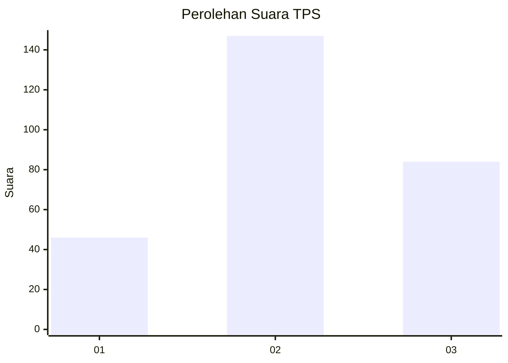
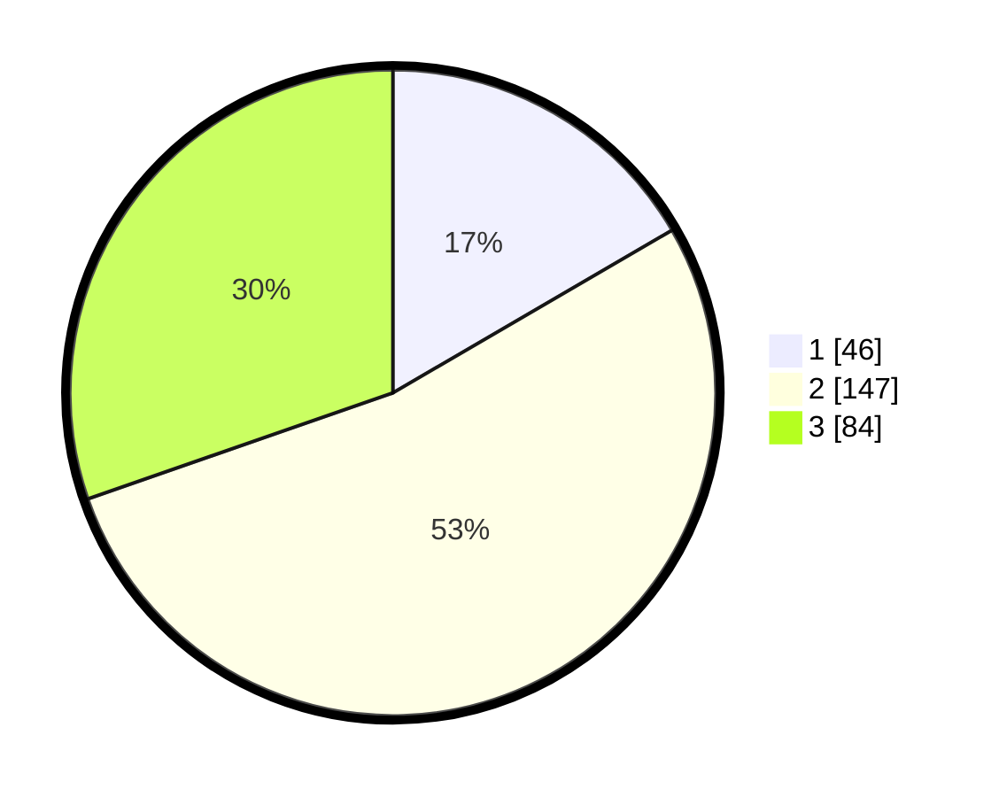

# Hasil

## Grafik

## Tabel

| No. | Nama Paslon    | Suara | Suara (raw) | Persentase |
|:--- |:-------------- | -----:| -----------:| ----------:|
| 1   | ANIES MUHAIMIN | 46    | [46][p-1]   | 16,61      |
| 2   | PRABOWO GIBRAN | 147   | [147][p-2]  | 53,07      |
| 3   | GANJAR MAHFUD  | 84    | [84][p-3]   | 30,32      |

[p-1]: https://github.com/gigit-pemilu/pemilu-2024-33-jawa-tengah/blob/main/pilpres/hitung-suara/sub/33-jawa-tengah/sub/74-kota-semarang/sub/15-ngaliyan/sub/1004-purwoyoso/sub/030-tps/sub/paslon-1.txt
[p-2]: https://github.com/gigit-pemilu/pemilu-2024-33-jawa-tengah/blob/main/pilpres/hitung-suara/sub/33-jawa-tengah/sub/74-kota-semarang/sub/15-ngaliyan/sub/1004-purwoyoso/sub/030-tps/sub/paslon-2.txt
[p-3]: https://github.com/gigit-pemilu/pemilu-2024-33-jawa-tengah/blob/main/pilpres/hitung-suara/sub/33-jawa-tengah/sub/74-kota-semarang/sub/15-ngaliyan/sub/1004-purwoyoso/sub/030-tps/sub/paslon-3.txt

## Foto C Plano

https://sirekap-obj-formc.kpu.go.id/2074/pemilu/ppwp/33/74/15/10/04/3374151004030-20240214-212054--03010367-3fab-45fd-bb14-52d0acf59d45.jpg

https://sirekap-obj-formc.kpu.go.id/2074/pemilu/ppwp/33/74/15/10/04/3374151004030-20240214-212142--6bbcd026-e01b-4185-8c6e-466ac2f32adc.jpg

https://sirekap-obj-formc.kpu.go.id/2074/pemilu/ppwp/33/74/15/10/04/3374151004030-20240214-223422--540e2bb5-7fff-465f-a2d7-9676a122dc07.jpg

## Metadata

| Key        | Value               |
| ---------- | ------------------- |
| Time Stamp | 2024-02-15 03:06:03 |

