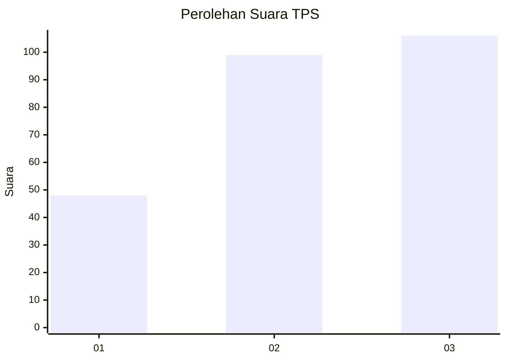
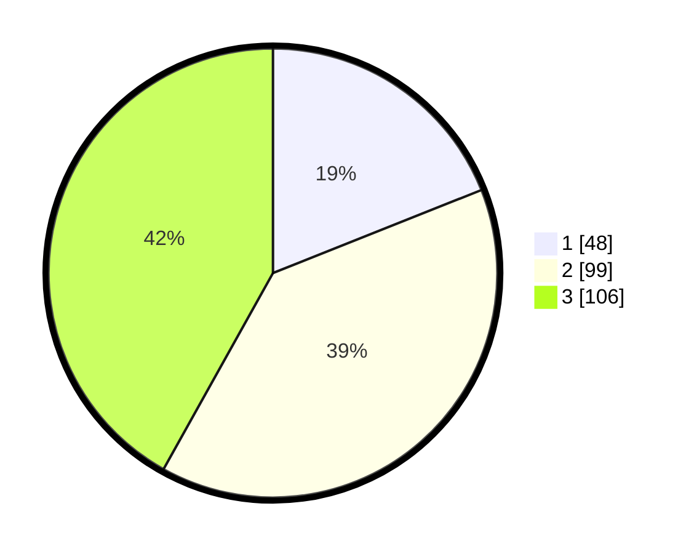

# Hasil

## Grafik

## Tabel

| No. | Nama Paslon    | Suara | Suara (raw) | Persentase |
|:--- |:-------------- | -----:| -----------:| ----------:|
| 1   | ANIES MUHAIMIN | 48    | [48][p-1]   | 18,97      |
| 2   | PRABOWO GIBRAN | 99    | [99][p-2]   | 39,13      |
| 3   | GANJAR MAHFUD  | 106   | [106][p-3]  | 41,90      |

[p-1]: https://github.com/gigit-pemilu/pemilu-2024/blob/main/pilpres/hitung-suara/sub/33-jawa-tengah/sub/74-kota-semarang/sub/15-ngaliyan/sub/1007-ngaliyan/sub/027-tps/sub/paslon-1.txt
[p-2]: https://github.com/gigit-pemilu/pemilu-2024/blob/main/pilpres/hitung-suara/sub/33-jawa-tengah/sub/74-kota-semarang/sub/15-ngaliyan/sub/1007-ngaliyan/sub/027-tps/sub/paslon-2.txt
[p-3]: https://github.com/gigit-pemilu/pemilu-2024/blob/main/pilpres/hitung-suara/sub/33-jawa-tengah/sub/74-kota-semarang/sub/15-ngaliyan/sub/1007-ngaliyan/sub/027-tps/sub/paslon-3.txt

## Foto C Plano

https://sirekap-obj-formc.kpu.go.id/0bed/pemilu/ppwp/33/74/15/10/07/3374151007027-20240214-224434--35ba0514-d3d9-4f02-9e2b-7c21e76ba497.jpg

https://sirekap-obj-formc.kpu.go.id/0bed/pemilu/ppwp/33/74/15/10/07/3374151007027-20240214-224553--4cb7ac6f-44e9-46b4-a027-c344618231ba.jpg

https://sirekap-obj-formc.kpu.go.id/0bed/pemilu/ppwp/33/74/15/10/07/3374151007027-20240215-010417--a379f6bf-d6ba-4662-81be-a5688d809216.jpg

## Metadata

| Key        | Value               |
| ---------- | ------------------- |
| Time Stamp | 2024-02-16 09:30:28 |

