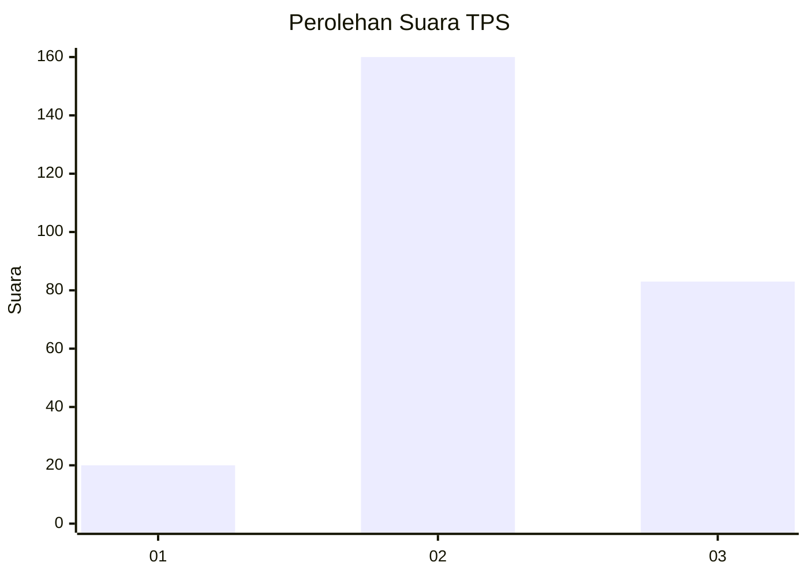
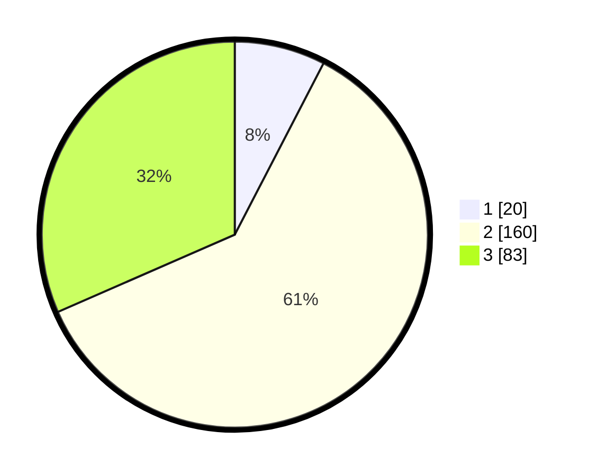

# Hasil

## Grafik

## Tabel

| No. | Nama Paslon    | Suara | Suara (raw) | Persentase |
|:--- |:-------------- | -----:| -----------:| ----------:|
| 1   | ANIES MUHAIMIN | 20    | [20][p-1]   | 7,60       |
| 2   | PRABOWO GIBRAN | 160   | [160][p-2]  | 60,84      |
| 3   | GANJAR MAHFUD  | 83    | [83][p-3]   | 31,56      |

[p-1]: https://github.com/gigit-pemilu/pemilu-2024/blob/main/pilpres/hitung-suara/sub/33-jawa-tengah/sub/74-kota-semarang/sub/15-ngaliyan/sub/1008-tambakaji/sub/048-tps/sub/paslon-1.txt
[p-2]: https://github.com/gigit-pemilu/pemilu-2024/blob/main/pilpres/hitung-suara/sub/33-jawa-tengah/sub/74-kota-semarang/sub/15-ngaliyan/sub/1008-tambakaji/sub/048-tps/sub/paslon-2.txt
[p-3]: https://github.com/gigit-pemilu/pemilu-2024/blob/main/pilpres/hitung-suara/sub/33-jawa-tengah/sub/74-kota-semarang/sub/15-ngaliyan/sub/1008-tambakaji/sub/048-tps/sub/paslon-3.txt

## Foto C Plano

https://sirekap-obj-formc.kpu.go.id/b777/pemilu/ppwp/33/74/15/10/08/3374151008048-20240222-203338--c4f28aac-c383-4a12-8d3a-d16d0fec784b.jpg

https://sirekap-obj-formc.kpu.go.id/b777/pemilu/ppwp/33/74/15/10/08/3374151008048-20240222-200540--ebee9533-667d-4ace-8c30-6ecdcdd2dc59.jpg

https://sirekap-obj-formc.kpu.go.id/b777/pemilu/ppwp/33/74/15/10/08/3374151008048-20240222-204340--95fa0a29-aa5a-4974-9469-818bd0c135b8.jpg

## Metadata

| Key        | Value               |
| ---------- | ------------------- |
| Time Stamp | 2024-02-24 22:31:28 |

