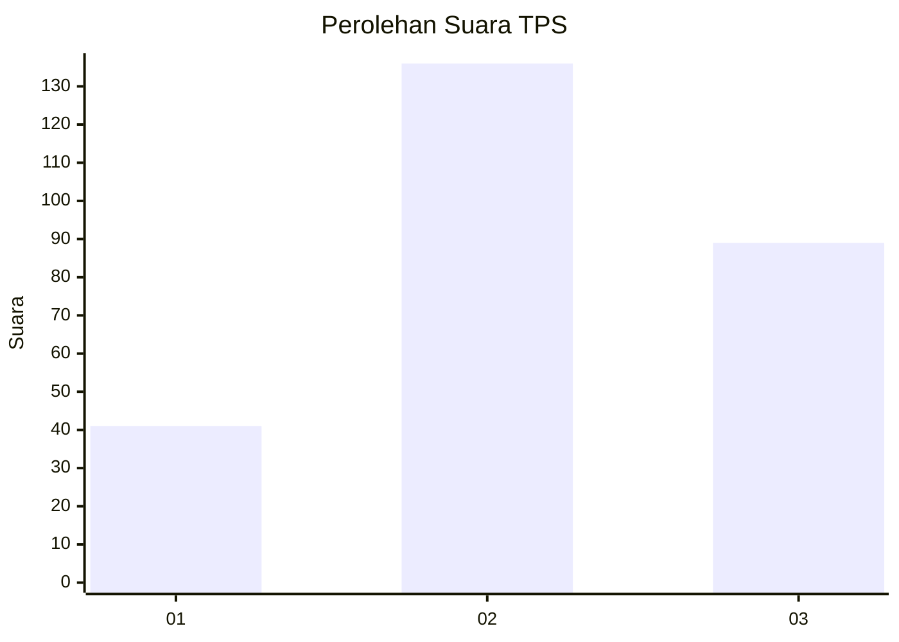
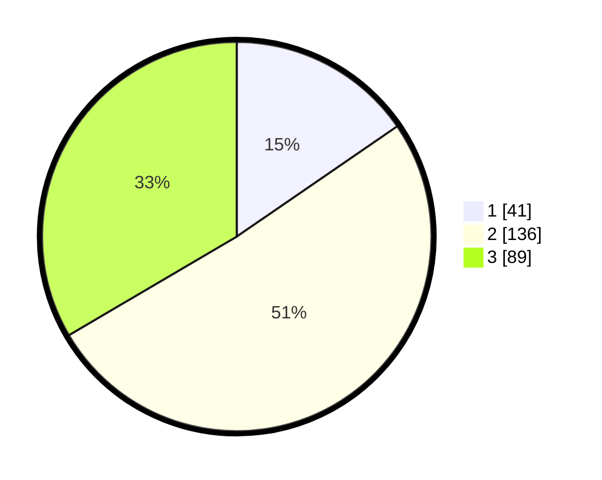

# Hasil

## Grafik

## Tabel

| No. | Nama Paslon    | Suara | Suara (raw) | Persentase |
|:--- |:-------------- | -----:| -----------:| ----------:|
| 1   | ANIES MUHAIMIN | 41    | [41][p-1]   | 15,41      |
| 2   | PRABOWO GIBRAN | 136   | [136][p-2]  | 51,13      |
| 3   | GANJAR MAHFUD  | 89    | [89][p-3]   | 33,46      |

[p-1]: https://github.com/gigit-pemilu/pemilu-2024/blob/main/pilpres/hitung-suara/sub/33-jawa-tengah/sub/74-kota-semarang/sub/15-ngaliyan/sub/1009-wonosari/sub/058-tps/sub/paslon-1.txt
[p-2]: https://github.com/gigit-pemilu/pemilu-2024/blob/main/pilpres/hitung-suara/sub/33-jawa-tengah/sub/74-kota-semarang/sub/15-ngaliyan/sub/1009-wonosari/sub/058-tps/sub/paslon-2.txt
[p-3]: https://github.com/gigit-pemilu/pemilu-2024/blob/main/pilpres/hitung-suara/sub/33-jawa-tengah/sub/74-kota-semarang/sub/15-ngaliyan/sub/1009-wonosari/sub/058-tps/sub/paslon-3.txt

## Foto C Plano

https://sirekap-obj-formc.kpu.go.id/d177/pemilu/ppwp/33/74/15/10/09/3374151009058-20240214-191506--238fa7d7-1998-4742-ad32-229b640bcaf7.jpg

https://sirekap-obj-formc.kpu.go.id/d177/pemilu/ppwp/33/74/15/10/09/3374151009058-20240214-191651--fc4179f9-be03-4330-9bfa-8a32000480c1.jpg

https://sirekap-obj-formc.kpu.go.id/d177/pemilu/ppwp/33/74/15/10/09/3374151009058-20240214-191740--b15fba5f-af03-4cd2-a8a3-fc93a9257292.jpg

## Metadata

| Key        | Value               |
| ---------- | ------------------- |
| Time Stamp | 2024-02-14 21:46:01 |

