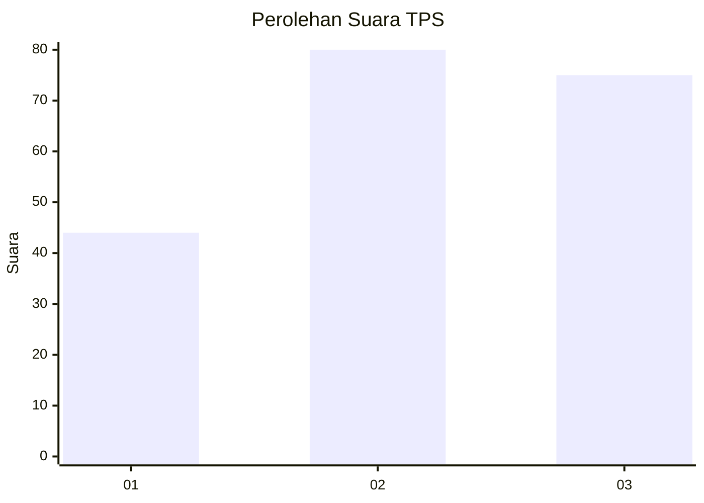
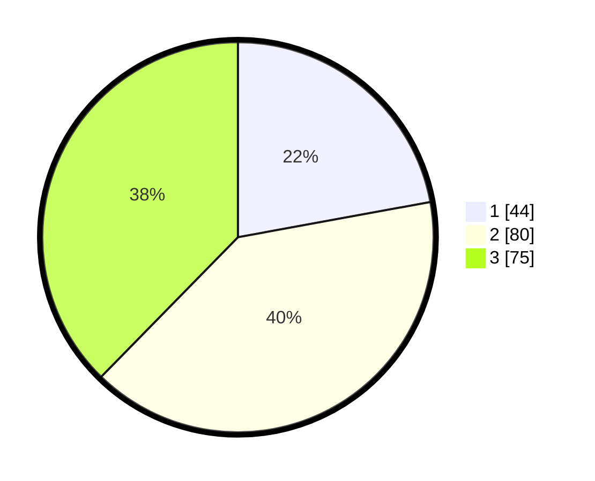

# Hasil

## Grafik

## Tabel

| No. | Nama Paslon    | Suara | Suara (raw) | Persentase |
|:--- |:-------------- | -----:| -----------:| ----------:|
| 1   | ANIES MUHAIMIN | 44    | [44][p-1]   | 22,11      |
| 2   | PRABOWO GIBRAN | 80    | [80][p-2]   | 40,20      |
| 3   | GANJAR MAHFUD  | 75    | [75][p-3]   | 37,69      |

[p-1]: https://github.com/gigit-pemilu/pemilu-2024/blob/main/pilpres/hitung-suara/sub/33-jawa-tengah/sub/74-kota-semarang/sub/16-tugu/sub/1001-jerakah/sub/007-tps/sub/paslon-1.txt
[p-2]: https://github.com/gigit-pemilu/pemilu-2024/blob/main/pilpres/hitung-suara/sub/33-jawa-tengah/sub/74-kota-semarang/sub/16-tugu/sub/1001-jerakah/sub/007-tps/sub/paslon-2.txt
[p-3]: https://github.com/gigit-pemilu/pemilu-2024/blob/main/pilpres/hitung-suara/sub/33-jawa-tengah/sub/74-kota-semarang/sub/16-tugu/sub/1001-jerakah/sub/007-tps/sub/paslon-3.txt

## Foto C Plano

https://sirekap-obj-formc.kpu.go.id/8f8c/pemilu/ppwp/33/74/16/10/01/3374161001007-20240214-155302--37678dc9-1674-42c0-8269-e58c3990462b.jpg

https://sirekap-obj-formc.kpu.go.id/8f8c/pemilu/ppwp/33/74/16/10/01/3374161001007-20240214-155436--5d6959ca-834b-43cd-a50f-5b66192e31e1.jpg

https://sirekap-obj-formc.kpu.go.id/8f8c/pemilu/ppwp/33/74/16/10/01/3374161001007-20240214-155535--50b3c437-8686-41a5-9997-8af9fa40d283.jpg

## Metadata

| Key        | Value               |
| ---------- | ------------------- |
| Time Stamp | 2024-02-16 08:30:27 |

