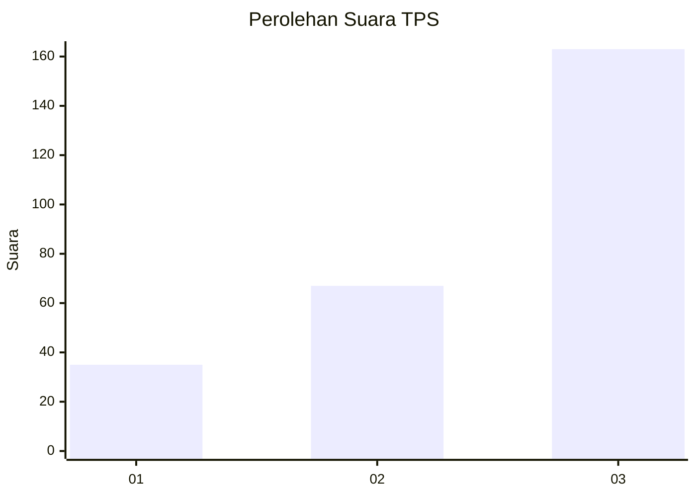
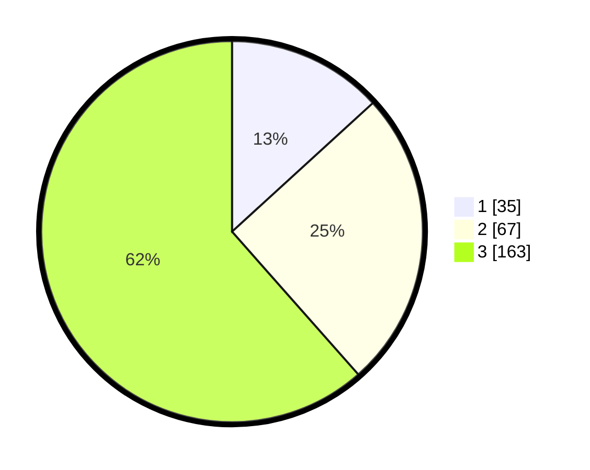

# Hasil

## Grafik

## Tabel

| No. | Nama Paslon    | Suara | Suara (raw) | Persentase |
|:--- |:-------------- | -----:| -----------:| ----------:|
| 1   | ANIES MUHAIMIN | 35    | [35][p-1]   | 13,21      |
| 2   | PRABOWO GIBRAN | 67    | [67][p-2]   | 25,28      |
| 3   | GANJAR MAHFUD  | 163   | [163][p-3]  | 61,51      |

[p-1]: https://github.com/gigit-pemilu/pemilu-2024-33-jawa-tengah/blob/main/pilpres/hitung-suara/sub/33-jawa-tengah/sub/74-kota-semarang/sub/16-tugu/sub/1005-mangkang-wetan/sub/001-tps/sub/paslon-1.txt
[p-2]: https://github.com/gigit-pemilu/pemilu-2024-33-jawa-tengah/blob/main/pilpres/hitung-suara/sub/33-jawa-tengah/sub/74-kota-semarang/sub/16-tugu/sub/1005-mangkang-wetan/sub/001-tps/sub/paslon-2.txt
[p-3]: https://github.com/gigit-pemilu/pemilu-2024-33-jawa-tengah/blob/main/pilpres/hitung-suara/sub/33-jawa-tengah/sub/74-kota-semarang/sub/16-tugu/sub/1005-mangkang-wetan/sub/001-tps/sub/paslon-3.txt

## Foto C Plano

https://sirekap-obj-formc.kpu.go.id/e7f2/pemilu/ppwp/33/74/16/10/05/3374161005001-20240217-095833--fd755e9b-e553-4f32-9e9b-fa29968bc468.jpg

https://sirekap-obj-formc.kpu.go.id/e7f2/pemilu/ppwp/33/74/16/10/05/3374161005001-20240217-100114--ecf621c4-56d7-4b01-b6ca-4ce8543d8bf2.jpg

https://sirekap-obj-formc.kpu.go.id/e7f2/pemilu/ppwp/33/74/16/10/05/3374161005001-20240217-100139--5a5e3fbd-31f5-4260-9141-197b1da92fcf.jpg

## Metadata

| Key        | Value               |
| ---------- | ------------------- |
| Time Stamp | 2024-02-22 16:00:00 |

