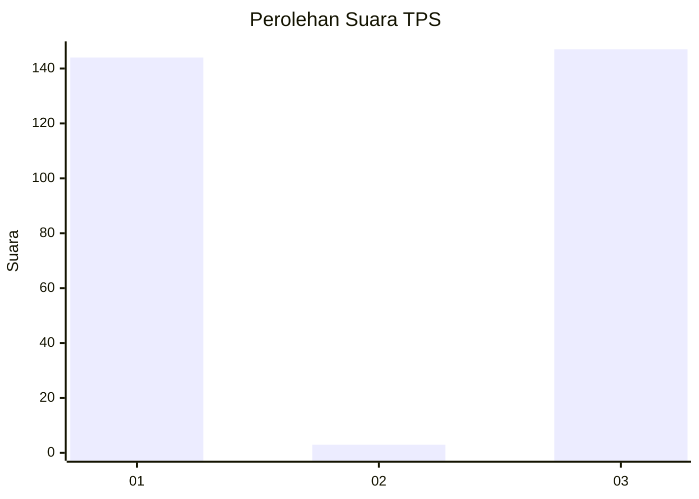
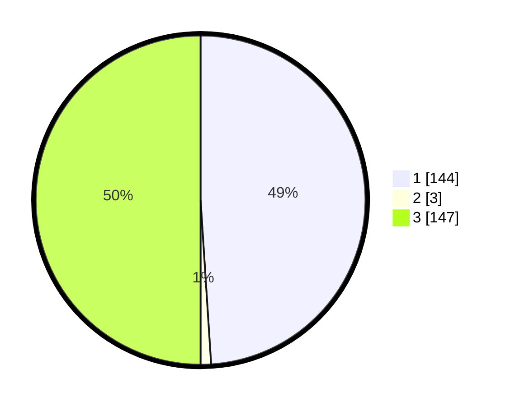

# Hasil

## Grafik

## Tabel

| No. | Nama Paslon    | Suara | Suara (raw) | Persentase |
|:--- |:-------------- | -----:| -----------:| ----------:|
| 1   | ANIES MUHAIMIN | 144   | [144][p-1]  | 48,98      |
| 2   | PRABOWO GIBRAN | 3     | [3][p-2]    | 1,02       |
| 3   | GANJAR MAHFUD  | 147   | [147][p-3]  | 50,00      |

[p-1]: https://github.com/gigit-pemilu/pemilu-2024-33-jawa-tengah/blob/main/pilpres/hitung-suara/sub/33-jawa-tengah/sub/74-kota-semarang/sub/16-tugu/sub/1006-mangkang-kulon/sub/008-tps/sub/paslon-1.txt
[p-2]: https://github.com/gigit-pemilu/pemilu-2024-33-jawa-tengah/blob/main/pilpres/hitung-suara/sub/33-jawa-tengah/sub/74-kota-semarang/sub/16-tugu/sub/1006-mangkang-kulon/sub/008-tps/sub/paslon-2.txt
[p-3]: https://github.com/gigit-pemilu/pemilu-2024-33-jawa-tengah/blob/main/pilpres/hitung-suara/sub/33-jawa-tengah/sub/74-kota-semarang/sub/16-tugu/sub/1006-mangkang-kulon/sub/008-tps/sub/paslon-3.txt

## Foto C Plano

https://sirekap-obj-formc.kpu.go.id/812b/pemilu/ppwp/33/74/16/10/06/3374161006008-20240214-234102--92f74bce-0317-42f3-b6e8-652eb71d6ef2.jpg

https://sirekap-obj-formc.kpu.go.id/812b/pemilu/ppwp/33/74/16/10/06/3374161006008-20240214-234135--d72369f8-67c8-414f-8fe0-e18f2fdb51a6.jpg

https://sirekap-obj-formc.kpu.go.id/812b/pemilu/ppwp/33/74/16/10/06/3374161006008-20240215-000923--a51c88d4-b575-40f7-ab5b-b3e7b08f7b43.jpg

## Metadata

| Key        | Value               |
| ---------- | ------------------- |
| Time Stamp | 2024-02-24 22:31:28 |

