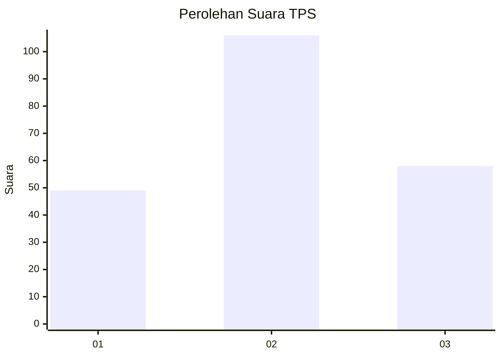
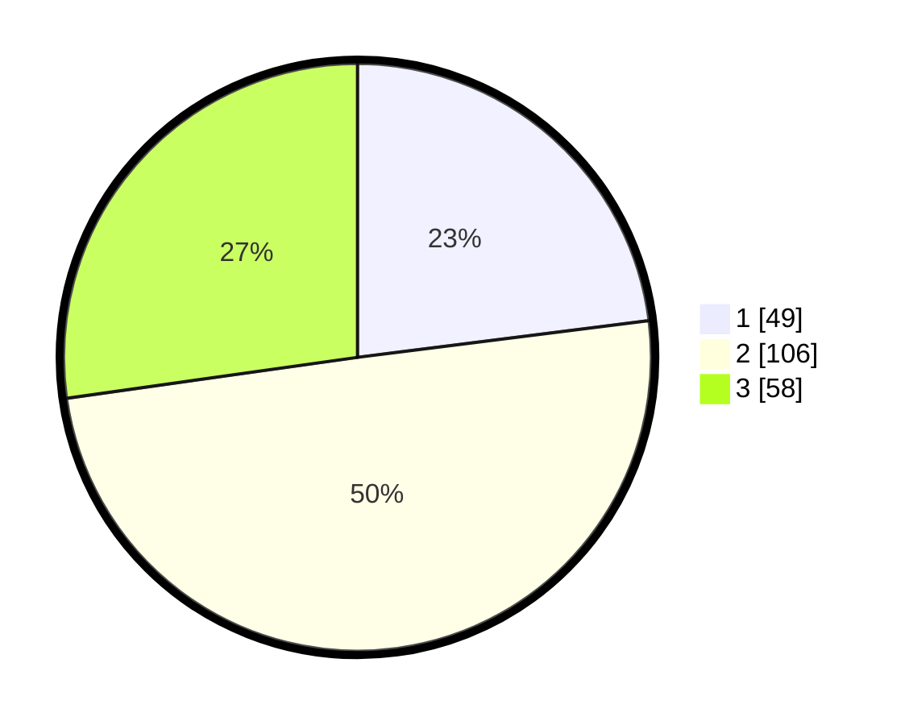

# Hasil

## Grafik

## Tabel

| No. | Nama Paslon    | Suara | Suara (raw) | Persentase |
|:--- |:-------------- | -----:| -----------:| ----------:|
| 1   | ANIES MUHAIMIN | 49    | [49][p-1]   | 23,00      |
| 2   | PRABOWO GIBRAN | 106   | [106][p-2]  | 49,77      |
| 3   | GANJAR MAHFUD  | 58    | [58][p-3]   | 27,23      |

[p-1]: https://github.com/gigit-pemilu/pemilu-2024-33-jawa-tengah/blob/main/pilpres/hitung-suara/sub/33-jawa-tengah/sub/75-kota-pekalongan/sub/01-pekalongan-barat/sub/1002-medono/sub/004-tps/sub/paslon-1.txt
[p-2]: https://github.com/gigit-pemilu/pemilu-2024-33-jawa-tengah/blob/main/pilpres/hitung-suara/sub/33-jawa-tengah/sub/75-kota-pekalongan/sub/01-pekalongan-barat/sub/1002-medono/sub/004-tps/sub/paslon-2.txt
[p-3]: https://github.com/gigit-pemilu/pemilu-2024-33-jawa-tengah/blob/main/pilpres/hitung-suara/sub/33-jawa-tengah/sub/75-kota-pekalongan/sub/01-pekalongan-barat/sub/1002-medono/sub/004-tps/sub/paslon-3.txt

## Foto C Plano

https://sirekap-obj-formc.kpu.go.id/3f7b/pemilu/ppwp/33/75/01/10/02/3375011002004-20240222-082701--7cbb7c1b-0771-47b9-97df-7a31b626d013.jpg

https://sirekap-obj-formc.kpu.go.id/3f7b/pemilu/ppwp/33/75/01/10/02/3375011002004-20240222-082746--2af9824a-9717-4d79-bfb3-727e81ffa3c3.jpg

https://sirekap-obj-formc.kpu.go.id/3f7b/pemilu/ppwp/33/75/01/10/02/3375011002004-20240222-082824--4d9b1739-3f99-4d56-b774-5c00c0469d31.jpg

## Metadata

| Key        | Value               |
| ---------- | ------------------- |
| Time Stamp | 2024-02-22 11:00:00 |

