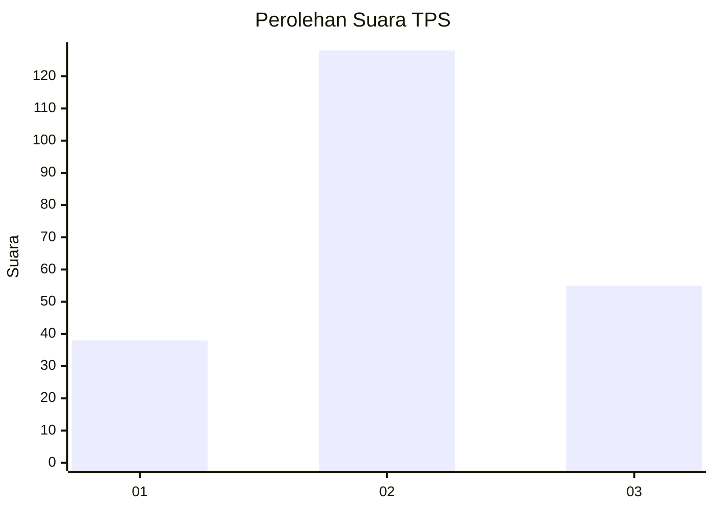
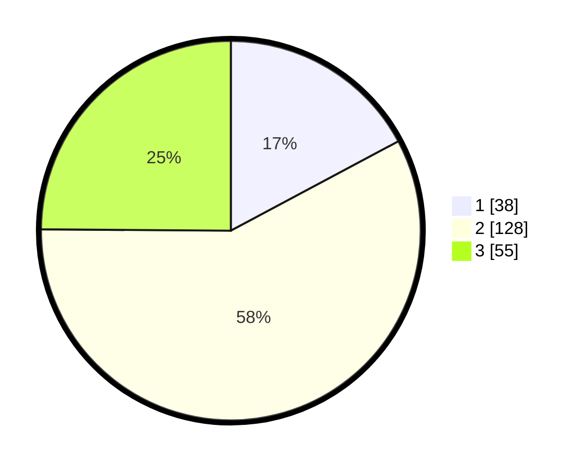

# Hasil

## Grafik

## Tabel

| No. | Nama Paslon    | Suara | Suara (raw) | Persentase |
|:--- |:-------------- | -----:| -----------:| ----------:|
| 1   | ANIES MUHAIMIN | 38    | [38][p-1]   | 17,19      |
| 2   | PRABOWO GIBRAN | 128   | [128][p-2]  | 57,92      |
| 3   | GANJAR MAHFUD  | 55    | [55][p-3]   | 24,89      |

[p-1]: https://github.com/gigit-pemilu/pemilu-2024/blob/main/pilpres/hitung-suara/sub/33-jawa-tengah/sub/75-kota-pekalongan/sub/01-pekalongan-barat/sub/1002-medono/sub/005-tps/sub/paslon-1.txt
[p-2]: https://github.com/gigit-pemilu/pemilu-2024/blob/main/pilpres/hitung-suara/sub/33-jawa-tengah/sub/75-kota-pekalongan/sub/01-pekalongan-barat/sub/1002-medono/sub/005-tps/sub/paslon-2.txt
[p-3]: https://github.com/gigit-pemilu/pemilu-2024/blob/main/pilpres/hitung-suara/sub/33-jawa-tengah/sub/75-kota-pekalongan/sub/01-pekalongan-barat/sub/1002-medono/sub/005-tps/sub/paslon-3.txt

## Foto C Plano

https://sirekap-obj-formc.kpu.go.id/8d65/pemilu/ppwp/33/75/01/10/02/3375011002005-20240222-082950--be831818-6b65-4c7f-b61a-c7f6f5714bd9.jpg

https://sirekap-obj-formc.kpu.go.id/8d65/pemilu/ppwp/33/75/01/10/02/3375011002005-20240222-083045--855cefc2-b3c5-4f83-b7c2-2820fe2e9710.jpg

https://sirekap-obj-formc.kpu.go.id/8d65/pemilu/ppwp/33/75/01/10/02/3375011002005-20240222-083132--7fcb6805-47fb-4128-bceb-761d76d9113a.jpg

## Metadata

| Key        | Value               |
| ---------- | ------------------- |
| Time Stamp | 2024-02-22 11:00:00 |

