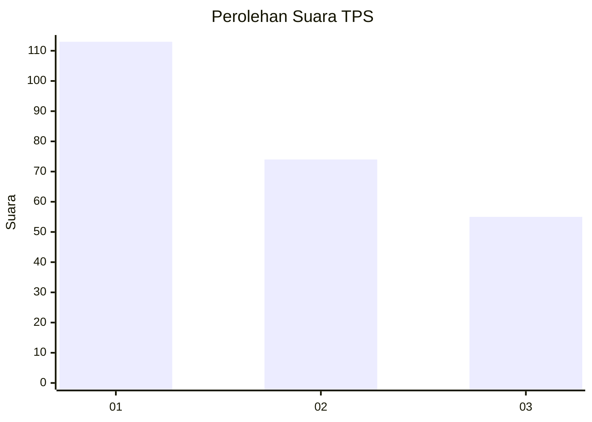
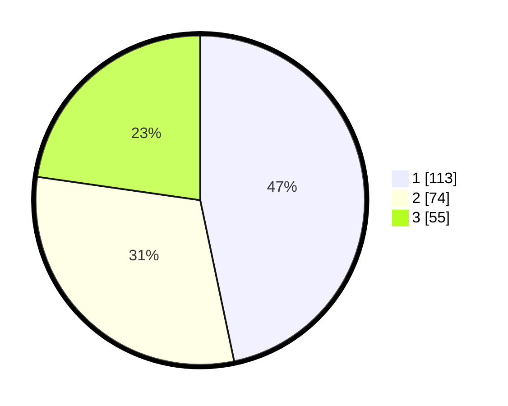

# Hasil

## Grafik

## Tabel

| No. | Nama Paslon    | Suara | Suara (raw) | Persentase |
|:--- |:-------------- | -----:| -----------:| ----------:|
| 1   | ANIES MUHAIMIN | 113   | [113][p-1]  | 46,69      |
| 2   | PRABOWO GIBRAN | 74    | [74][p-2]   | 30,58      |
| 3   | GANJAR MAHFUD  | 55    | [55][p-3]   | 22,73      |

[p-1]: https://github.com/gigit-pemilu/pemilu-2024-33-jawa-tengah/blob/main/pilpres/hitung-suara/sub/33-jawa-tengah/sub/75-kota-pekalongan/sub/01-pekalongan-barat/sub/1002-medono/sub/032-tps/sub/paslon-1.txt
[p-2]: https://github.com/gigit-pemilu/pemilu-2024-33-jawa-tengah/blob/main/pilpres/hitung-suara/sub/33-jawa-tengah/sub/75-kota-pekalongan/sub/01-pekalongan-barat/sub/1002-medono/sub/032-tps/sub/paslon-2.txt
[p-3]: https://github.com/gigit-pemilu/pemilu-2024-33-jawa-tengah/blob/main/pilpres/hitung-suara/sub/33-jawa-tengah/sub/75-kota-pekalongan/sub/01-pekalongan-barat/sub/1002-medono/sub/032-tps/sub/paslon-3.txt

## Foto C Plano

https://sirekap-obj-formc.kpu.go.id/9940/pemilu/ppwp/33/75/01/10/02/3375011002032-20240222-093929--c87c23b5-1463-4281-9f78-318daaec4d05.jpg

https://sirekap-obj-formc.kpu.go.id/9940/pemilu/ppwp/33/75/01/10/02/3375011002032-20240222-093949--7e6c5944-4b51-4d5a-9c8c-9eb51bc9436a.jpg

https://sirekap-obj-formc.kpu.go.id/9940/pemilu/ppwp/33/75/01/10/02/3375011002032-20240222-094034--18c1e783-1e28-4ef7-b557-660ef814b43c.jpg

## Metadata

| Key        | Value               |
| ---------- | ------------------- |
| Time Stamp | 2024-02-22 11:00:00 |

