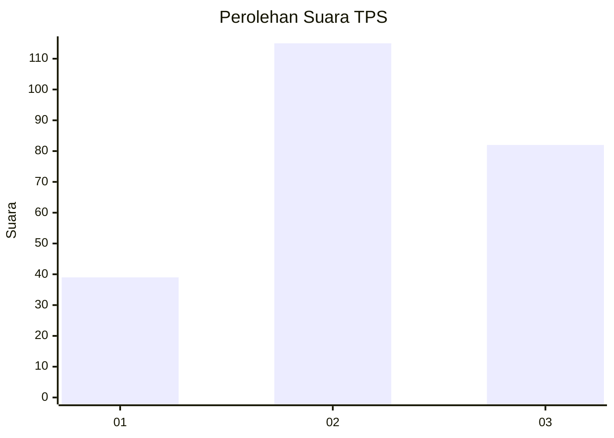
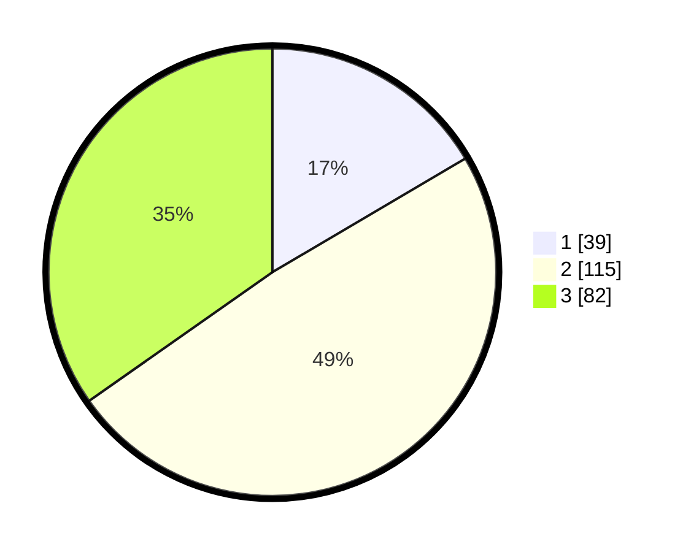

# Hasil

## Grafik

## Tabel

| No. | Nama Paslon    | Suara | Suara (raw) | Persentase |
|:--- |:-------------- | -----:| -----------:| ----------:|
| 1   | ANIES MUHAIMIN | 39    | [39][p-1]   | 16,53      |
| 2   | PRABOWO GIBRAN | 115   | [115][p-2]  | 48,73      |
| 3   | GANJAR MAHFUD  | 82    | [82][p-3]   | 34,75      |

[p-1]: https://github.com/gigit-pemilu/pemilu-2024/blob/main/pilpres/hitung-suara/sub/33-jawa-tengah/sub/75-kota-pekalongan/sub/01-pekalongan-barat/sub/1004-sapuro-kebulen/sub/004-tps/sub/paslon-1.txt
[p-2]: https://github.com/gigit-pemilu/pemilu-2024/blob/main/pilpres/hitung-suara/sub/33-jawa-tengah/sub/75-kota-pekalongan/sub/01-pekalongan-barat/sub/1004-sapuro-kebulen/sub/004-tps/sub/paslon-2.txt
[p-3]: https://github.com/gigit-pemilu/pemilu-2024/blob/main/pilpres/hitung-suara/sub/33-jawa-tengah/sub/75-kota-pekalongan/sub/01-pekalongan-barat/sub/1004-sapuro-kebulen/sub/004-tps/sub/paslon-3.txt

## Foto C Plano

https://sirekap-obj-formc.kpu.go.id/571a/pemilu/ppwp/33/75/01/10/04/3375011004004-20240215-074550--e3f34da8-cb3a-42fe-986e-6dcc87e9e6ca.jpg

https://sirekap-obj-formc.kpu.go.id/571a/pemilu/ppwp/33/75/01/10/04/3375011004004-20240215-074717--c09fc987-623c-45ec-896a-abe868dcf38d.jpg

https://sirekap-obj-formc.kpu.go.id/571a/pemilu/ppwp/33/75/01/10/04/3375011004004-20240215-074826--03a74f7a-2b39-41c3-bf38-d3d4f96db0fa.jpg

## Metadata

| Key        | Value               |
| ---------- | ------------------- |
| Time Stamp | 2024-02-15 15:00:29 |

