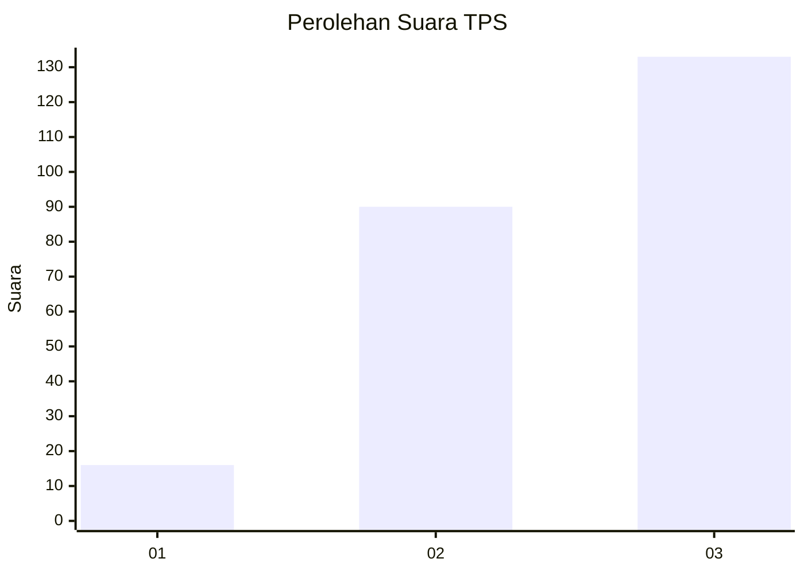
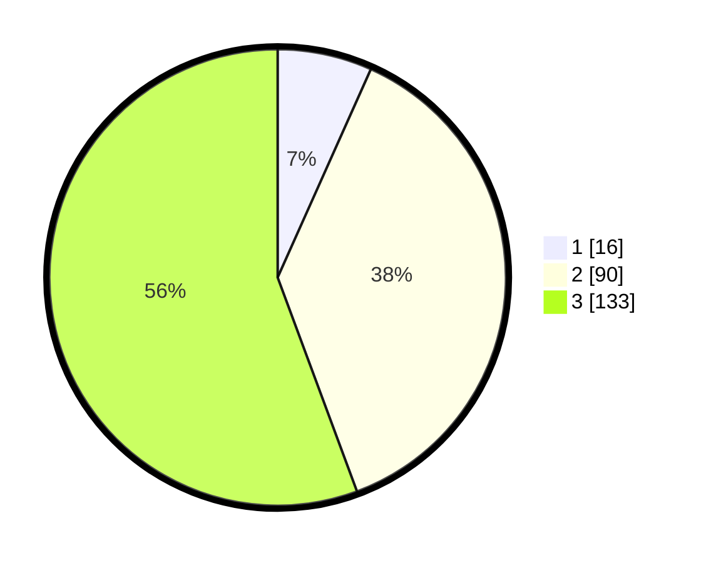

# Hasil

## Grafik

## Tabel

| No. | Nama Paslon    | Suara | Suara (raw) | Persentase |
|:--- |:-------------- | -----:| -----------:| ----------:|
| 1   | ANIES MUHAIMIN | 16    | [16][p-1]   | 6,69       |
| 2   | PRABOWO GIBRAN | 90    | [90][p-2]   | 37,66      |
| 3   | GANJAR MAHFUD  | 133   | [133][p-3]  | 55,65      |

[p-1]: https://github.com/gigit-pemilu/pemilu-2024/blob/main/pilpres/hitung-suara/sub/33-jawa-tengah/sub/75-kota-pekalongan/sub/01-pekalongan-barat/sub/1008-pasirkratonkramat/sub/023-tps/sub/paslon-1.txt
[p-2]: https://github.com/gigit-pemilu/pemilu-2024/blob/main/pilpres/hitung-suara/sub/33-jawa-tengah/sub/75-kota-pekalongan/sub/01-pekalongan-barat/sub/1008-pasirkratonkramat/sub/023-tps/sub/paslon-2.txt
[p-3]: https://github.com/gigit-pemilu/pemilu-2024/blob/main/pilpres/hitung-suara/sub/33-jawa-tengah/sub/75-kota-pekalongan/sub/01-pekalongan-barat/sub/1008-pasirkratonkramat/sub/023-tps/sub/paslon-3.txt

## Foto C Plano

https://sirekap-obj-formc.kpu.go.id/a6bf/pemilu/ppwp/33/75/01/10/08/3375011008023-20240221-154309--de6cf44e-4497-4d61-a7ae-6b95159581c3.jpg

https://sirekap-obj-formc.kpu.go.id/a6bf/pemilu/ppwp/33/75/01/10/08/3375011008023-20240221-154516--5bc96d58-e27e-4e4b-9ddf-6a28083a86d3.jpg

https://sirekap-obj-formc.kpu.go.id/a6bf/pemilu/ppwp/33/75/01/10/08/3375011008023-20240221-154549--23b047ab-9c1f-41ee-99b8-2df4f9c64a1b.jpg

## Metadata

| Key        | Value               |
| ---------- | ------------------- |
| Time Stamp | 2024-02-22 10:00:00 |

## DATA PEMILIH TETAP

Jumlah pemilih dalam DPT: **267**.
 * L: **435**.
 * P: **432**.

## DATA PENGGUNA HAK PILIH

Jumlah pengguna hak pilih dalam DPT: **245**.
 * L: **323**.
 * P: **442**.

Jumlah pengguna hak pilih dalam DPTb: **804**.
 * L: **8**.
 * P: **888**.

Jumlah pengguna hak pilih dalam DPK: **4**.
 * L: **84**.
 * P: **80**.

Jumlah pengguna hak pilih: **247**.
 * L: **425**.
 * P: **422**.

## JUMLAH SUARA SAH DAN TIDAK SAH

JUMLAH SELURUH SUARA SAH: **239**.

JUMLAH SUARA TIDAK SAH: **8**.

JUMLAH SELURUH SUARA SAH DAN SUARA TIDAK SAH: **247**.

