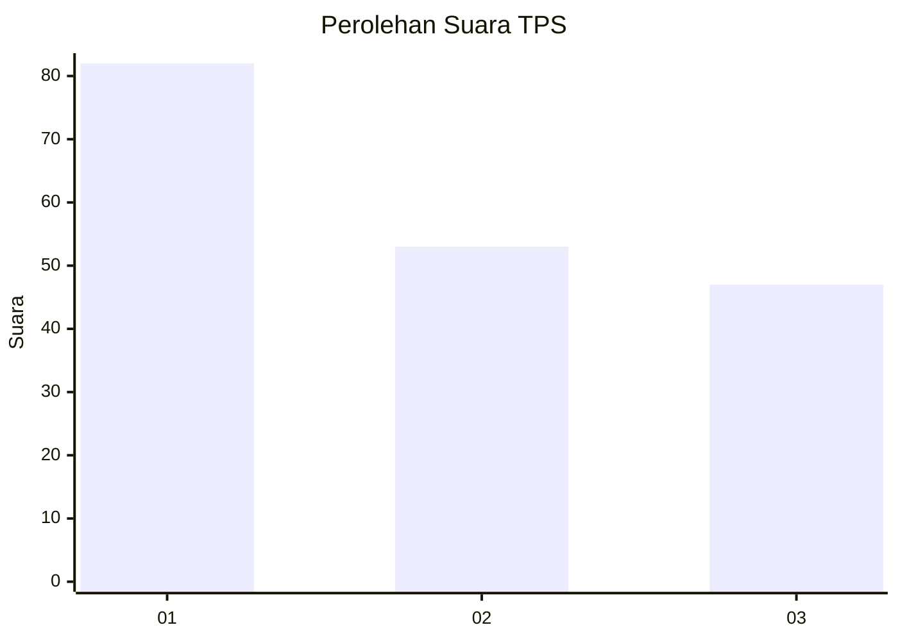
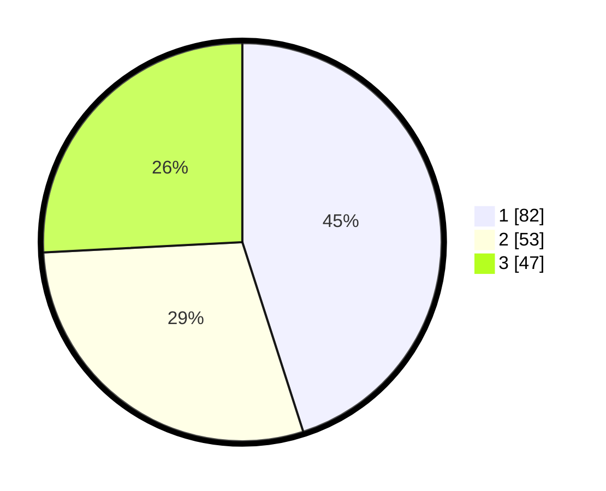

# Hasil

## Grafik

## Tabel

| No. | Nama Paslon    | Suara | Suara (raw) | Persentase |
|:--- |:-------------- | -----:| -----------:| ----------:|
| 1   | ANIES MUHAIMIN | 82    | [82][p-1]   | 45,05      |
| 2   | PRABOWO GIBRAN | 53    | [53][p-2]   | 29,12      |
| 3   | GANJAR MAHFUD  | 47    | [47][p-3]   | 25,82      |

[p-1]: https://github.com/gigit-pemilu/pemilu-2024-33-jawa-tengah/blob/main/pilpres/hitung-suara/sub/33-jawa-tengah/sub/75-kota-pekalongan/sub/01-pekalongan-barat/sub/1012-pringrejo/sub/022-tps/sub/paslon-1.txt
[p-2]: https://github.com/gigit-pemilu/pemilu-2024-33-jawa-tengah/blob/main/pilpres/hitung-suara/sub/33-jawa-tengah/sub/75-kota-pekalongan/sub/01-pekalongan-barat/sub/1012-pringrejo/sub/022-tps/sub/paslon-2.txt
[p-3]: https://github.com/gigit-pemilu/pemilu-2024-33-jawa-tengah/blob/main/pilpres/hitung-suara/sub/33-jawa-tengah/sub/75-kota-pekalongan/sub/01-pekalongan-barat/sub/1012-pringrejo/sub/022-tps/sub/paslon-3.txt

## Foto C Plano

https://sirekap-obj-formc.kpu.go.id/8958/pemilu/ppwp/33/75/01/10/12/3375011012022-20240222-110903--94f8fd89-e2be-40d8-b770-876c665f7a28.jpg

https://sirekap-obj-formc.kpu.go.id/8958/pemilu/ppwp/33/75/01/10/12/3375011012022-20240222-110935--e2e72d2d-3b2f-4626-a85b-54e3459c14a5.jpg

https://sirekap-obj-formc.kpu.go.id/8958/pemilu/ppwp/33/75/01/10/12/3375011012022-20240222-112847--fcb93175-0752-4cb3-a0e3-1a522dd4ca8b.jpg

## Metadata

| Key        | Value               |
| ---------- | ------------------- |
| Time Stamp | 2024-02-22 12:00:00 |

