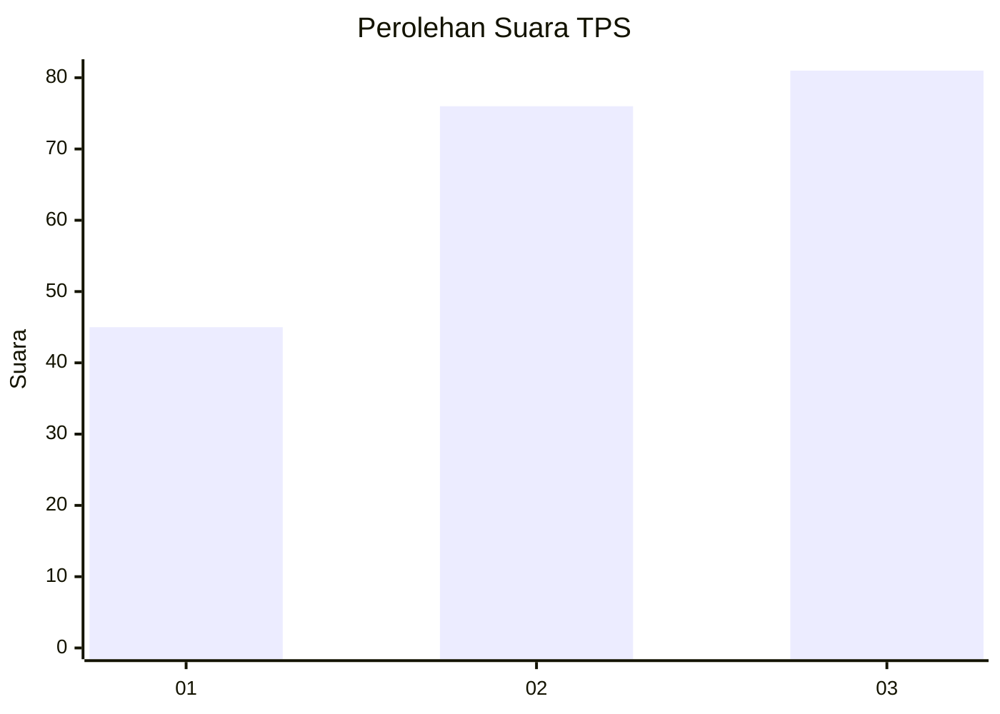
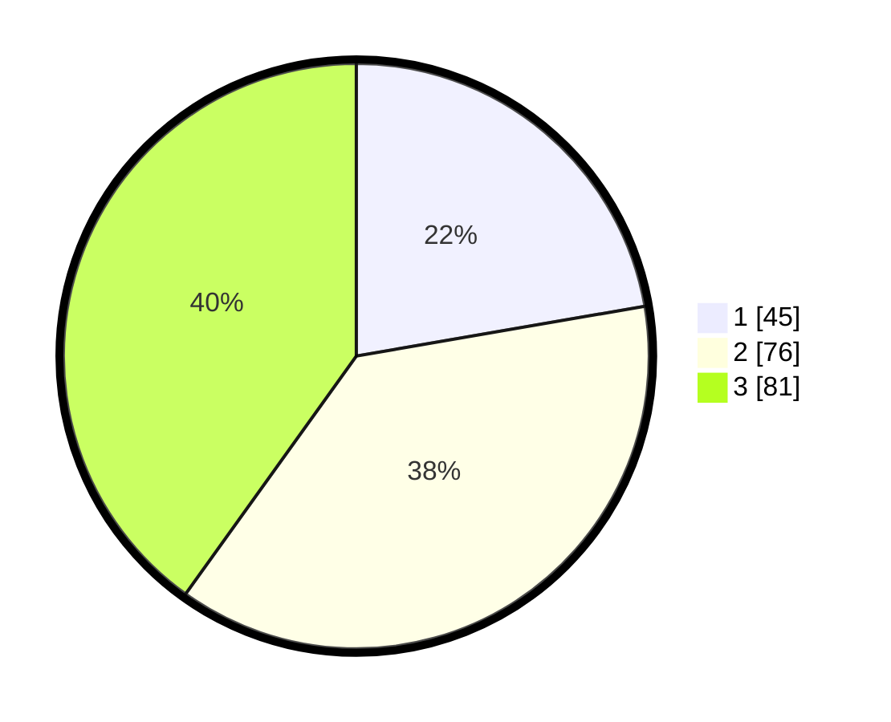

# Hasil

## Grafik

## Tabel

| No. | Nama Paslon    | Suara | Suara (raw) | Persentase |
|:--- |:-------------- | -----:| -----------:| ----------:|
| 1   | ANIES MUHAIMIN | 45    | [45][p-1]   | 22,28      |
| 2   | PRABOWO GIBRAN | 76    | [76][p-2]   | 37,62      |
| 3   | GANJAR MAHFUD  | 81    | [81][p-3]   | 40,10      |

[p-1]: https://github.com/gigit-pemilu/pemilu-2024/blob/main/pilpres/hitung-suara/sub/33-jawa-tengah/sub/75-kota-pekalongan/sub/02-pekalongan-timur/sub/1002-noyontaansari/sub/001-tps/sub/paslon-1.txt
[p-2]: https://github.com/gigit-pemilu/pemilu-2024/blob/main/pilpres/hitung-suara/sub/33-jawa-tengah/sub/75-kota-pekalongan/sub/02-pekalongan-timur/sub/1002-noyontaansari/sub/001-tps/sub/paslon-2.txt
[p-3]: https://github.com/gigit-pemilu/pemilu-2024/blob/main/pilpres/hitung-suara/sub/33-jawa-tengah/sub/75-kota-pekalongan/sub/02-pekalongan-timur/sub/1002-noyontaansari/sub/001-tps/sub/paslon-3.txt

## Foto C Plano

https://sirekap-obj-formc.kpu.go.id/27c9/pemilu/ppwp/33/75/02/10/02/3375021002001-20240223-201020--56593f1a-f399-4509-ad2c-1314fe5144a2.jpg

https://sirekap-obj-formc.kpu.go.id/27c9/pemilu/ppwp/33/75/02/10/02/3375021002001-20240223-201137--6ba4d653-0fc2-45f5-bd1d-be85093e888f.jpg

https://sirekap-obj-formc.kpu.go.id/27c9/pemilu/ppwp/33/75/02/10/02/3375021002001-20240223-201059--a88c807b-3c80-4d4b-9132-e72107b92a8b.jpg

## Metadata

| Key        | Value               |
| ---------- | ------------------- |
| Time Stamp | 2024-02-24 22:31:28 |

