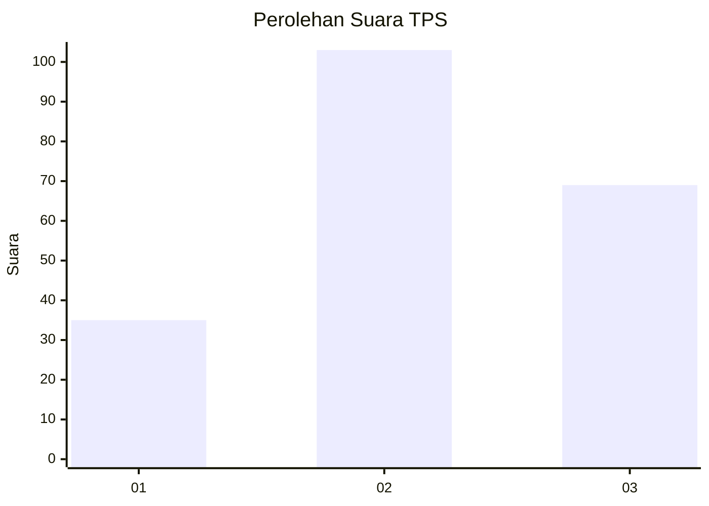
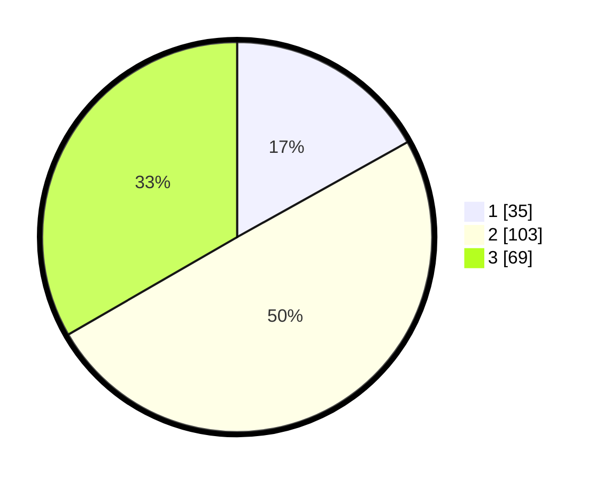

# Hasil

## Grafik

## Tabel

| No. | Nama Paslon    | Suara | Suara (raw) | Persentase |
|:--- |:-------------- | -----:| -----------:| ----------:|
| 1   | ANIES MUHAIMIN | 35    | [35][p-1]   | 16,91      |
| 2   | PRABOWO GIBRAN | 103   | [103][p-2]  | 49,76      |
| 3   | GANJAR MAHFUD  | 69    | [69][p-3]   | 33,33      |

[p-1]: https://github.com/gigit-pemilu/pemilu-2024-33-jawa-tengah/blob/main/pilpres/hitung-suara/sub/33-jawa-tengah/sub/75-kota-pekalongan/sub/02-pekalongan-timur/sub/1002-noyontaansari/sub/005-tps/sub/paslon-1.txt
[p-2]: https://github.com/gigit-pemilu/pemilu-2024-33-jawa-tengah/blob/main/pilpres/hitung-suara/sub/33-jawa-tengah/sub/75-kota-pekalongan/sub/02-pekalongan-timur/sub/1002-noyontaansari/sub/005-tps/sub/paslon-2.txt
[p-3]: https://github.com/gigit-pemilu/pemilu-2024-33-jawa-tengah/blob/main/pilpres/hitung-suara/sub/33-jawa-tengah/sub/75-kota-pekalongan/sub/02-pekalongan-timur/sub/1002-noyontaansari/sub/005-tps/sub/paslon-3.txt

## Foto C Plano

https://sirekap-obj-formc.kpu.go.id/c06d/pemilu/ppwp/33/75/02/10/02/3375021002005-20240216-151605--0b32289a-3ba1-4d16-9048-7bbf9dbaa9d0.jpg

https://sirekap-obj-formc.kpu.go.id/c06d/pemilu/ppwp/33/75/02/10/02/3375021002005-20240216-145529--1d11264e-0c25-4b79-9a41-c17a2156cc22.jpg

https://sirekap-obj-formc.kpu.go.id/c06d/pemilu/ppwp/33/75/02/10/02/3375021002005-20240216-145606--eeca96a8-d903-4d99-a12d-27c67cfa850e.jpg

## Metadata

| Key        | Value               |
| ---------- | ------------------- |
| Time Stamp | 2024-02-16 16:25:10 |

