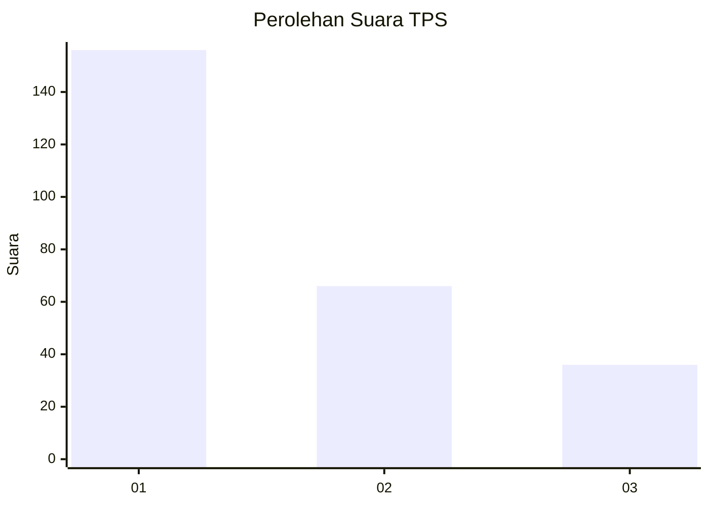
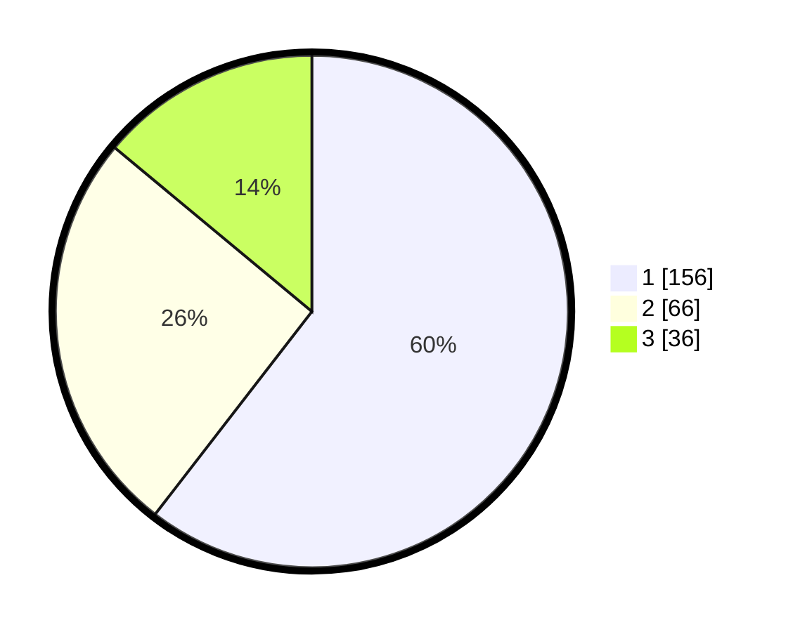

# Hasil

## Grafik

## Tabel

| No. | Nama Paslon    | Suara | Suara (raw) | Persentase |
|:--- |:-------------- | -----:| -----------:| ----------:|
| 1   | ANIES MUHAIMIN | 156   | [156][p-1]  | 60,47      |
| 2   | PRABOWO GIBRAN | 66    | [66][p-2]   | 25,58      |
| 3   | GANJAR MAHFUD  | 36    | [36][p-3]   | 13,95      |

[p-1]: https://github.com/gigit-pemilu/pemilu-2024/blob/main/pilpres/hitung-suara/sub/33-jawa-tengah/sub/75-kota-pekalongan/sub/02-pekalongan-timur/sub/1004-kauman/sub/013-tps/sub/paslon-1.txt
[p-2]: https://github.com/gigit-pemilu/pemilu-2024/blob/main/pilpres/hitung-suara/sub/33-jawa-tengah/sub/75-kota-pekalongan/sub/02-pekalongan-timur/sub/1004-kauman/sub/013-tps/sub/paslon-2.txt
[p-3]: https://github.com/gigit-pemilu/pemilu-2024/blob/main/pilpres/hitung-suara/sub/33-jawa-tengah/sub/75-kota-pekalongan/sub/02-pekalongan-timur/sub/1004-kauman/sub/013-tps/sub/paslon-3.txt

## Foto C Plano

https://sirekap-obj-formc.kpu.go.id/cc15/pemilu/ppwp/33/75/02/10/04/3375021004013-20240215-045934--6bf23bdf-c5ce-4491-9d59-e641173cbefa.jpg

https://sirekap-obj-formc.kpu.go.id/cc15/pemilu/ppwp/33/75/02/10/04/3375021004013-20240215-050034--463dd998-7c4b-4059-ba13-56f9b30ae3d9.jpg

https://sirekap-obj-formc.kpu.go.id/cc15/pemilu/ppwp/33/75/02/10/04/3375021004013-20240215-050206--5c15f52a-a6b7-49ec-9b0d-21fed32d438b.jpg

## Metadata

| Key        | Value               |
| ---------- | ------------------- |
| Time Stamp | 2024-02-15 16:30:25 |

