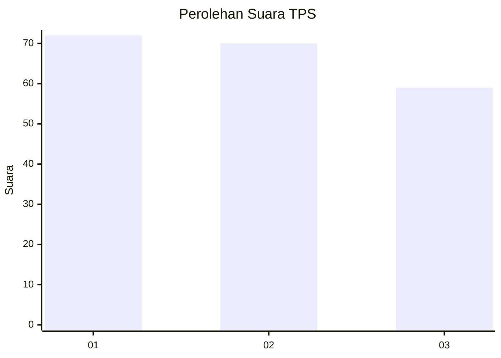
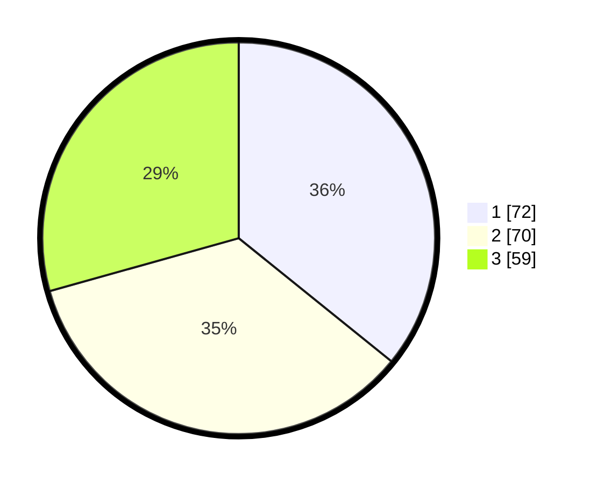

# Hasil

## Grafik

## Tabel

| No. | Nama Paslon    | Suara | Suara (raw) | Persentase |
|:--- |:-------------- | -----:| -----------:| ----------:|
| 1   | ANIES MUHAIMIN | 72    | [72][p-1]   | 35,82      |
| 2   | PRABOWO GIBRAN | 70    | [70][p-2]   | 34,83      |
| 3   | GANJAR MAHFUD  | 59    | [59][p-3]   | 29,35      |

[p-1]: https://github.com/gigit-pemilu/pemilu-2024/blob/main/pilpres/hitung-suara/sub/33-jawa-tengah/sub/75-kota-pekalongan/sub/02-pekalongan-timur/sub/1004-kauman/sub/031-tps/sub/paslon-1.txt
[p-2]: https://github.com/gigit-pemilu/pemilu-2024/blob/main/pilpres/hitung-suara/sub/33-jawa-tengah/sub/75-kota-pekalongan/sub/02-pekalongan-timur/sub/1004-kauman/sub/031-tps/sub/paslon-2.txt
[p-3]: https://github.com/gigit-pemilu/pemilu-2024/blob/main/pilpres/hitung-suara/sub/33-jawa-tengah/sub/75-kota-pekalongan/sub/02-pekalongan-timur/sub/1004-kauman/sub/031-tps/sub/paslon-3.txt

## Foto C Plano

https://sirekap-obj-formc.kpu.go.id/69dc/pemilu/ppwp/33/75/02/10/04/3375021004031-20240215-093008--69f70b36-5121-4b54-9c14-f841d482dc1a.jpg

https://sirekap-obj-formc.kpu.go.id/69dc/pemilu/ppwp/33/75/02/10/04/3375021004031-20240214-155051--c1fdf61f-15bc-479a-a76b-bf4b36c1aba9.jpg

https://sirekap-obj-formc.kpu.go.id/69dc/pemilu/ppwp/33/75/02/10/04/3375021004031-20240214-155442--9d4643b2-f574-4159-8573-99e65e549e64.jpg

## Metadata

| Key        | Value               |
| ---------- | ------------------- |
| Time Stamp | 2024-02-15 12:00:28 |

