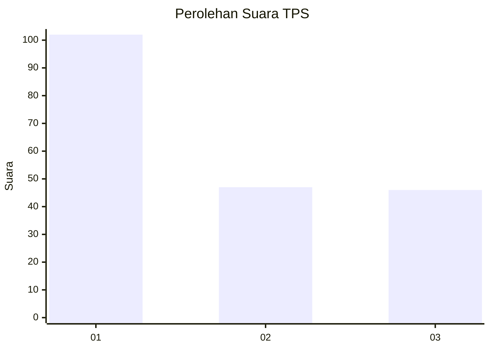
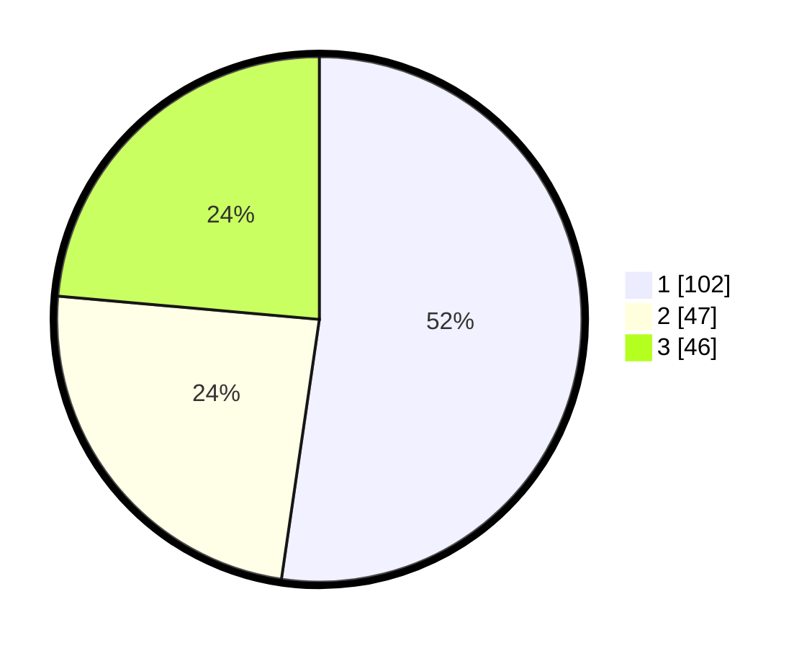

# Hasil

## Grafik

## Tabel

| No. | Nama Paslon    | Suara | Suara (raw) | Persentase |
|:--- |:-------------- | -----:| -----------:| ----------:|
| 1   | ANIES MUHAIMIN | 102   | [102][p-1]  | 52,31      |
| 2   | PRABOWO GIBRAN | 47    | [47][p-2]   | 24,10      |
| 3   | GANJAR MAHFUD  | 46    | [46][p-3]   | 23,59      |

[p-1]: https://github.com/gigit-pemilu/pemilu-2024/blob/main/pilpres/hitung-suara/sub/33-jawa-tengah/sub/75-kota-pekalongan/sub/02-pekalongan-timur/sub/1007-poncol/sub/002-tps/sub/paslon-1.txt
[p-2]: https://github.com/gigit-pemilu/pemilu-2024/blob/main/pilpres/hitung-suara/sub/33-jawa-tengah/sub/75-kota-pekalongan/sub/02-pekalongan-timur/sub/1007-poncol/sub/002-tps/sub/paslon-2.txt
[p-3]: https://github.com/gigit-pemilu/pemilu-2024/blob/main/pilpres/hitung-suara/sub/33-jawa-tengah/sub/75-kota-pekalongan/sub/02-pekalongan-timur/sub/1007-poncol/sub/002-tps/sub/paslon-3.txt

## Foto C Plano

https://sirekap-obj-formc.kpu.go.id/d657/pemilu/ppwp/33/75/02/10/07/3375021007002-20240215-022329--c074ebf9-ec43-406a-8797-9d8eaded7c0c.jpg

https://sirekap-obj-formc.kpu.go.id/d657/pemilu/ppwp/33/75/02/10/07/3375021007002-20240215-022504--a1fec4b5-f910-4c4e-bb41-d84410478d73.jpg

https://sirekap-obj-formc.kpu.go.id/d657/pemilu/ppwp/33/75/02/10/07/3375021007002-20240215-022537--280bc5e8-4bba-403b-ac48-46f7d9a68fcd.jpg

## Metadata

| Key        | Value               |
| ---------- | ------------------- |
| Time Stamp | 2024-02-15 15:30:25 |

