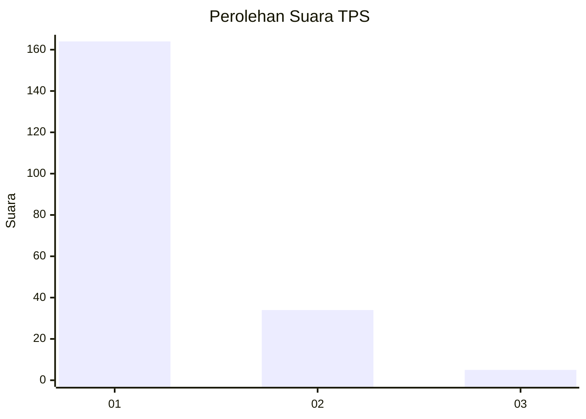
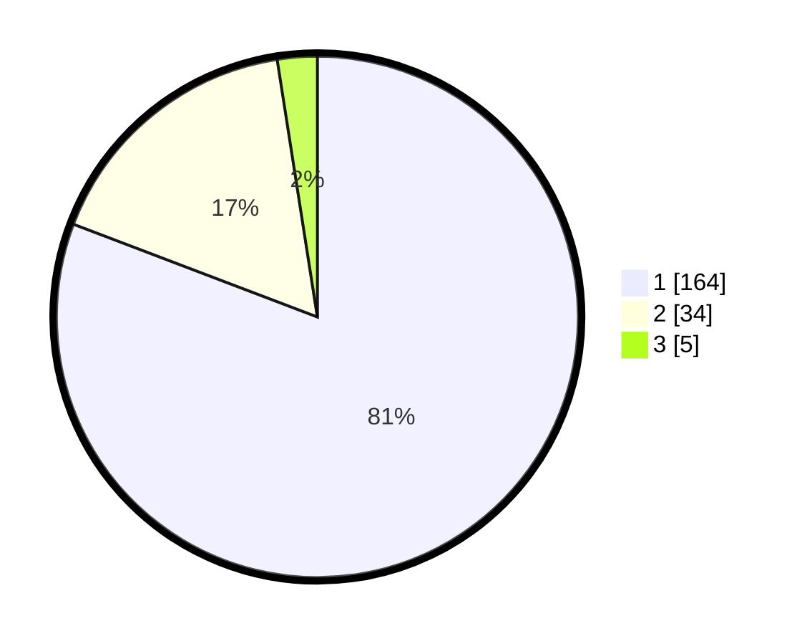

# Hasil

## Grafik

## Tabel

| No. | Nama Paslon    | Suara | Suara (raw) | Persentase |
|:--- |:-------------- | -----:| -----------:| ----------:|
| 1   | ANIES MUHAIMIN | 164   | [164][p-1]  | 80,79      |
| 2   | PRABOWO GIBRAN | 34    | [34][p-2]   | 16,75      |
| 3   | GANJAR MAHFUD  | 5     | [5][p-3]    | 2,46       |

[p-1]: https://github.com/gigit-pemilu/pemilu-2024-33-jawa-tengah/blob/main/pilpres/hitung-suara/sub/33-jawa-tengah/sub/75-kota-pekalongan/sub/02-pekalongan-timur/sub/1008-klego/sub/015-tps/sub/paslon-1.txt
[p-2]: https://github.com/gigit-pemilu/pemilu-2024-33-jawa-tengah/blob/main/pilpres/hitung-suara/sub/33-jawa-tengah/sub/75-kota-pekalongan/sub/02-pekalongan-timur/sub/1008-klego/sub/015-tps/sub/paslon-2.txt
[p-3]: https://github.com/gigit-pemilu/pemilu-2024-33-jawa-tengah/blob/main/pilpres/hitung-suara/sub/33-jawa-tengah/sub/75-kota-pekalongan/sub/02-pekalongan-timur/sub/1008-klego/sub/015-tps/sub/paslon-3.txt

## Foto C Plano

https://sirekap-obj-formc.kpu.go.id/843f/pemilu/ppwp/33/75/02/10/08/3375021008015-20240215-005328--1a85c0cc-aed6-415a-bc80-2cf6bd27e45e.jpg

https://sirekap-obj-formc.kpu.go.id/843f/pemilu/ppwp/33/75/02/10/08/3375021008015-20240214-160109--f6b9ea07-4d38-46f5-99ed-9e3ed6a03af6.jpg

https://sirekap-obj-formc.kpu.go.id/843f/pemilu/ppwp/33/75/02/10/08/3375021008015-20240215-004455--657ba557-9a80-4e4b-b7a8-e8f1ff481e9b.jpg

## Metadata

| Key        | Value               |
| ---------- | ------------------- |
| Time Stamp | 2024-02-22 15:00:00 |

