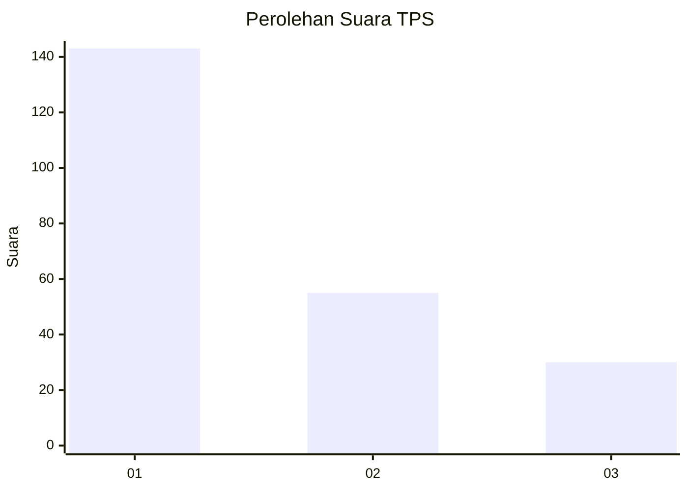
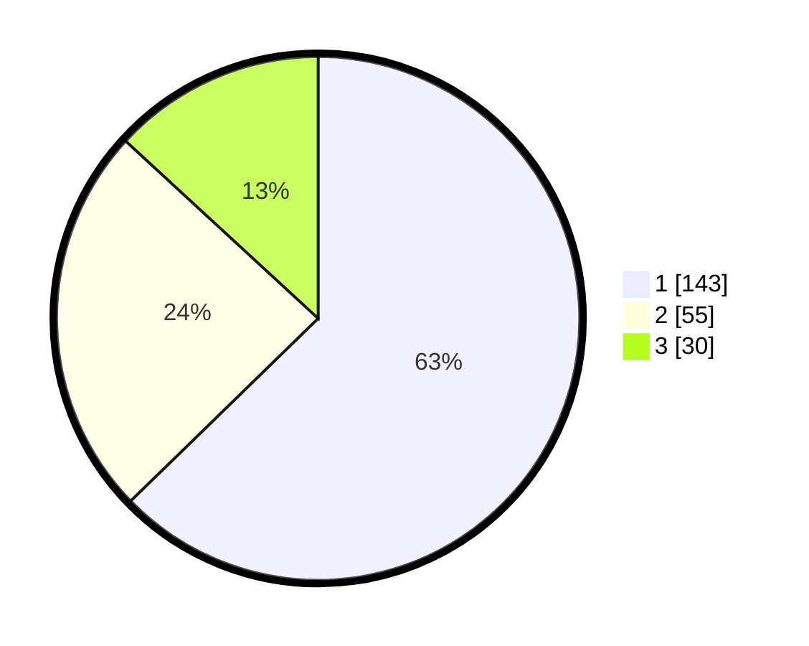

# Hasil

## Grafik

## Tabel

| No. | Nama Paslon    | Suara | Suara (raw) | Persentase |
|:--- |:-------------- | -----:| -----------:| ----------:|
| 1   | ANIES MUHAIMIN | 143   | [143][p-1]  | 62,72      |
| 2   | PRABOWO GIBRAN | 55    | [55][p-2]   | 24,12      |
| 3   | GANJAR MAHFUD  | 30    | [30][p-3]   | 13,16      |

[p-1]: https://github.com/gigit-pemilu/pemilu-2024/blob/main/pilpres/hitung-suara/sub/33-jawa-tengah/sub/75-kota-pekalongan/sub/02-pekalongan-timur/sub/1008-klego/sub/026-tps/sub/paslon-1.txt
[p-2]: https://github.com/gigit-pemilu/pemilu-2024/blob/main/pilpres/hitung-suara/sub/33-jawa-tengah/sub/75-kota-pekalongan/sub/02-pekalongan-timur/sub/1008-klego/sub/026-tps/sub/paslon-2.txt
[p-3]: https://github.com/gigit-pemilu/pemilu-2024/blob/main/pilpres/hitung-suara/sub/33-jawa-tengah/sub/75-kota-pekalongan/sub/02-pekalongan-timur/sub/1008-klego/sub/026-tps/sub/paslon-3.txt

## Foto C Plano

https://sirekap-obj-formc.kpu.go.id/3b25/pemilu/ppwp/33/75/02/10/08/3375021008026-20240214-160156--484c06d3-13cd-41db-91ac-c9802789ebc7.jpg

https://sirekap-obj-formc.kpu.go.id/3b25/pemilu/ppwp/33/75/02/10/08/3375021008026-20240214-225234--e53e0f91-3962-4cb6-88d5-fad1182eccf5.jpg

https://sirekap-obj-formc.kpu.go.id/3b25/pemilu/ppwp/33/75/02/10/08/3375021008026-20240214-225422--ae84dd2a-a69e-4595-abe4-e6ac093e40a4.jpg

## Metadata

| Key        | Value               |
| ---------- | ------------------- |
| Time Stamp | 2024-02-15 12:00:28 |

