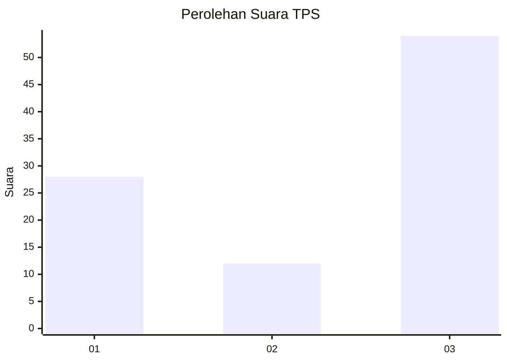
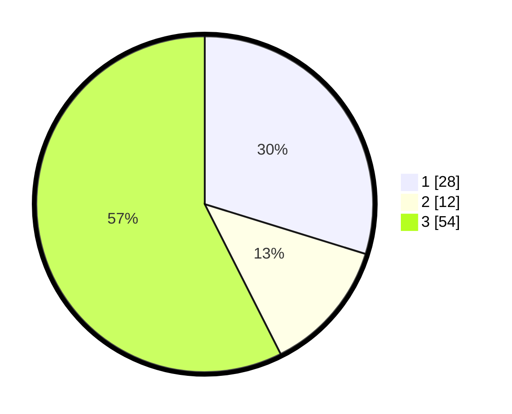

# Hasil

## Grafik

## Tabel

| No. | Nama Paslon    | Suara | Suara (raw) | Persentase |
|:--- |:-------------- | -----:| -----------:| ----------:|
| 1   | ANIES MUHAIMIN | 28    | [28][p-1]   | 29,79      |
| 2   | PRABOWO GIBRAN | 12    | [12][p-2]   | 12,77      |
| 3   | GANJAR MAHFUD  | 54    | [54][p-3]   | 57,45      |

[p-1]: https://github.com/gigit-pemilu/pemilu-2024-33-jawa-tengah/blob/main/pilpres/hitung-suara/sub/33-jawa-tengah/sub/75-kota-pekalongan/sub/02-pekalongan-timur/sub/1010-setono/sub/020-tps/sub/paslon-1.txt
[p-2]: https://github.com/gigit-pemilu/pemilu-2024-33-jawa-tengah/blob/main/pilpres/hitung-suara/sub/33-jawa-tengah/sub/75-kota-pekalongan/sub/02-pekalongan-timur/sub/1010-setono/sub/020-tps/sub/paslon-2.txt
[p-3]: https://github.com/gigit-pemilu/pemilu-2024-33-jawa-tengah/blob/main/pilpres/hitung-suara/sub/33-jawa-tengah/sub/75-kota-pekalongan/sub/02-pekalongan-timur/sub/1010-setono/sub/020-tps/sub/paslon-3.txt

## Foto C Plano

https://sirekap-obj-formc.kpu.go.id/b966/pemilu/ppwp/33/75/02/10/10/3375021010020-20240223-174437--b8532929-c048-4e46-bd6a-88e3a05c1fe3.jpg

https://sirekap-obj-formc.kpu.go.id/b966/pemilu/ppwp/33/75/02/10/10/3375021010020-20240223-174508--ae889303-9631-431b-af35-0e62cc389a69.jpg

https://sirekap-obj-formc.kpu.go.id/b966/pemilu/ppwp/33/75/02/10/10/3375021010020-20240223-174555--39ae479c-c11b-414a-8236-3391a91052cb.jpg

## Metadata

| Key        | Value               |
| ---------- | ------------------- |
| Time Stamp | 2024-02-24 22:31:28 |

