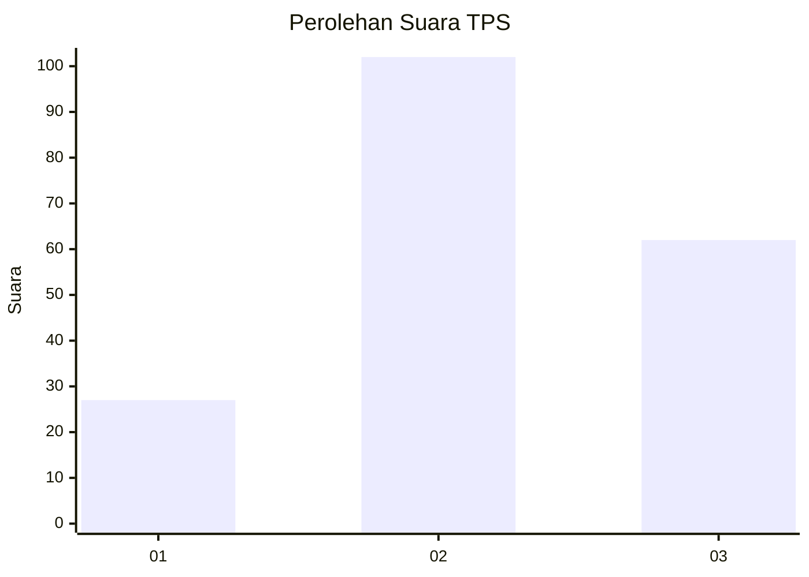
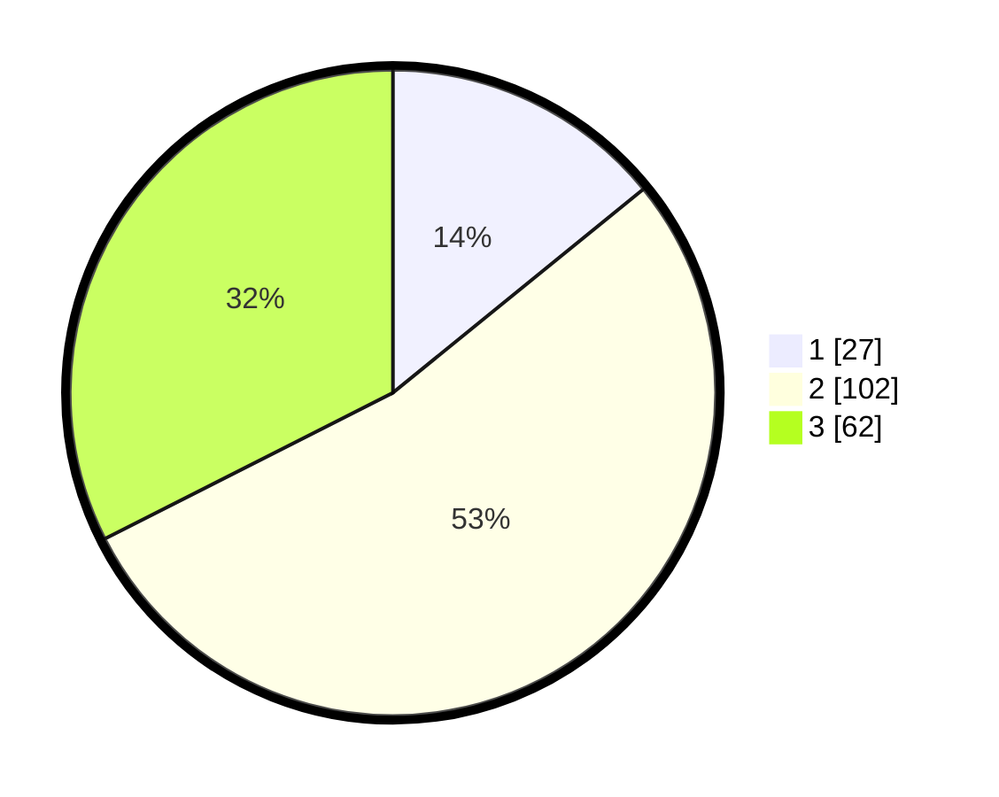

# Hasil

## Grafik

## Tabel

| No. | Nama Paslon    | Suara | Suara (raw) | Persentase |
|:--- |:-------------- | -----:| -----------:| ----------:|
| 1   | ANIES MUHAIMIN | 27    | [27][p-1]   | 14,14      |
| 2   | PRABOWO GIBRAN | 102   | [102][p-2]  | 53,40      |
| 3   | GANJAR MAHFUD  | 62    | [62][p-3]   | 32,46      |

[p-1]: https://github.com/gigit-pemilu/pemilu-2024-33-jawa-tengah/blob/main/pilpres/hitung-suara/sub/33-jawa-tengah/sub/75-kota-pekalongan/sub/03-pekalongan-utara/sub/1002-krapyak/sub/002-tps/sub/paslon-1.txt
[p-2]: https://github.com/gigit-pemilu/pemilu-2024-33-jawa-tengah/blob/main/pilpres/hitung-suara/sub/33-jawa-tengah/sub/75-kota-pekalongan/sub/03-pekalongan-utara/sub/1002-krapyak/sub/002-tps/sub/paslon-2.txt
[p-3]: https://github.com/gigit-pemilu/pemilu-2024-33-jawa-tengah/blob/main/pilpres/hitung-suara/sub/33-jawa-tengah/sub/75-kota-pekalongan/sub/03-pekalongan-utara/sub/1002-krapyak/sub/002-tps/sub/paslon-3.txt

## Foto C Plano

https://sirekap-obj-formc.kpu.go.id/95b6/pemilu/ppwp/33/75/03/10/02/3375031002002-20240222-145910--55633b76-10bf-4b18-805d-47cdc8f2005c.jpg

https://sirekap-obj-formc.kpu.go.id/95b6/pemilu/ppwp/33/75/03/10/02/3375031002002-20240222-150003--0803e7b7-225d-4e95-8703-4ee093a45d33.jpg

https://sirekap-obj-formc.kpu.go.id/95b6/pemilu/ppwp/33/75/03/10/02/3375031002002-20240222-150110--4314d785-7b77-400b-8560-2337b07ef98b.jpg

## Metadata

| Key        | Value               |
| ---------- | ------------------- |
| Time Stamp | 2024-02-24 22:31:28 |

