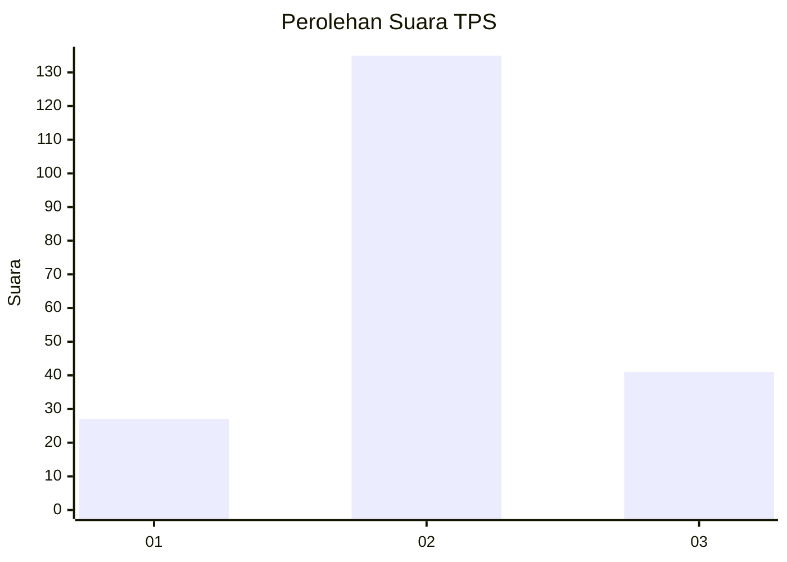
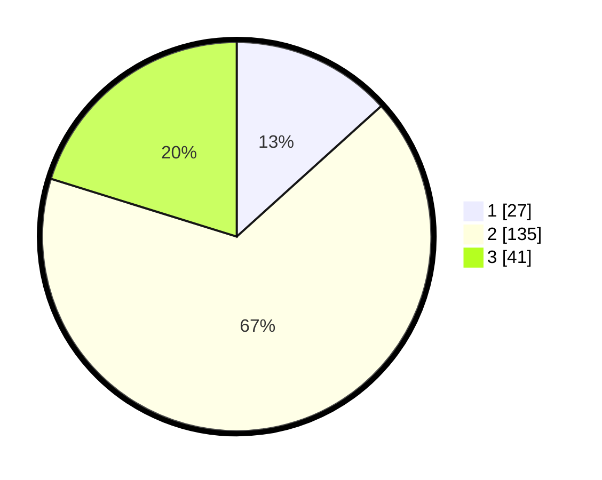

# Hasil

## Grafik

## Tabel

| No. | Nama Paslon    | Suara | Suara (raw) | Persentase |
|:--- |:-------------- | -----:| -----------:| ----------:|
| 1   | ANIES MUHAIMIN | 27    | [27][p-1]   | 13,30      |
| 2   | PRABOWO GIBRAN | 135   | [135][p-2]  | 66,50      |
| 3   | GANJAR MAHFUD  | 41    | [41][p-3]   | 20,20      |

[p-1]: https://github.com/gigit-pemilu/pemilu-2024-33-jawa-tengah/blob/main/pilpres/hitung-suara/sub/33-jawa-tengah/sub/75-kota-pekalongan/sub/03-pekalongan-utara/sub/1002-krapyak/sub/004-tps/sub/paslon-1.txt
[p-2]: https://github.com/gigit-pemilu/pemilu-2024-33-jawa-tengah/blob/main/pilpres/hitung-suara/sub/33-jawa-tengah/sub/75-kota-pekalongan/sub/03-pekalongan-utara/sub/1002-krapyak/sub/004-tps/sub/paslon-2.txt
[p-3]: https://github.com/gigit-pemilu/pemilu-2024-33-jawa-tengah/blob/main/pilpres/hitung-suara/sub/33-jawa-tengah/sub/75-kota-pekalongan/sub/03-pekalongan-utara/sub/1002-krapyak/sub/004-tps/sub/paslon-3.txt

## Foto C Plano

https://sirekap-obj-formc.kpu.go.id/3d21/pemilu/ppwp/33/75/03/10/02/3375031002004-20240215-024703--442ae7c4-9239-4afb-afd5-9776211764b3.jpg

https://sirekap-obj-formc.kpu.go.id/3d21/pemilu/ppwp/33/75/03/10/02/3375031002004-20240215-084750--1252f3d7-9129-494b-8328-e571eee2610a.jpg

https://sirekap-obj-formc.kpu.go.id/3d21/pemilu/ppwp/33/75/03/10/02/3375031002004-20240215-084916--89ba6a9f-c83d-4128-93e2-f946746ed19c.jpg

## Metadata

| Key        | Value               |
| ---------- | ------------------- |
| Time Stamp | 2024-02-15 16:00:26 |

