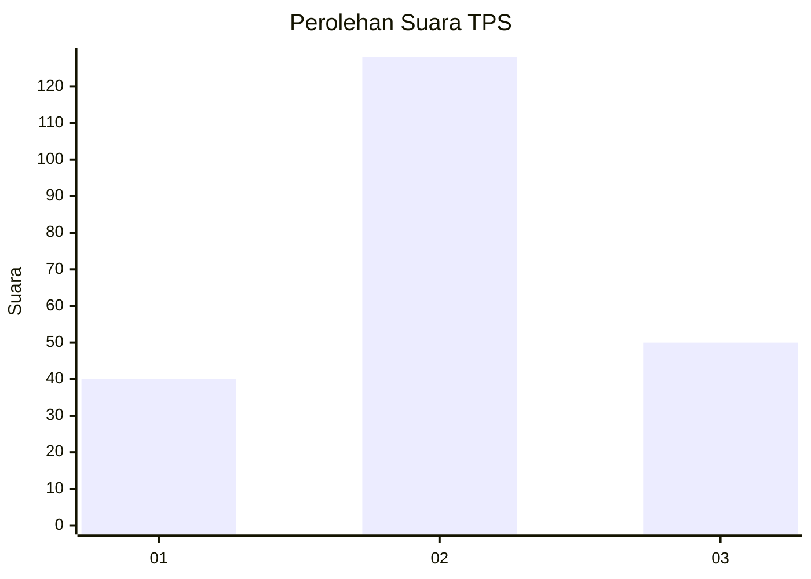
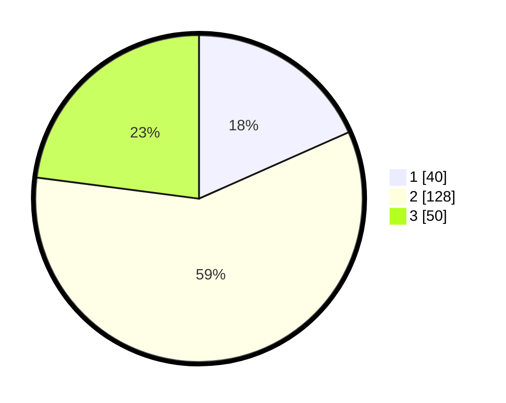

# Hasil

## Grafik

## Tabel

| No. | Nama Paslon    | Suara | Suara (raw) | Persentase |
|:--- |:-------------- | -----:| -----------:| ----------:|
| 1   | ANIES MUHAIMIN | 40    | [40][p-1]   | 18,35      |
| 2   | PRABOWO GIBRAN | 128   | [128][p-2]  | 58,72      |
| 3   | GANJAR MAHFUD  | 50    | [50][p-3]   | 22,94      |

[p-1]: https://github.com/gigit-pemilu/pemilu-2024-33-jawa-tengah/blob/main/pilpres/hitung-suara/sub/33-jawa-tengah/sub/75-kota-pekalongan/sub/03-pekalongan-utara/sub/1002-krapyak/sub/005-tps/sub/paslon-1.txt
[p-2]: https://github.com/gigit-pemilu/pemilu-2024-33-jawa-tengah/blob/main/pilpres/hitung-suara/sub/33-jawa-tengah/sub/75-kota-pekalongan/sub/03-pekalongan-utara/sub/1002-krapyak/sub/005-tps/sub/paslon-2.txt
[p-3]: https://github.com/gigit-pemilu/pemilu-2024-33-jawa-tengah/blob/main/pilpres/hitung-suara/sub/33-jawa-tengah/sub/75-kota-pekalongan/sub/03-pekalongan-utara/sub/1002-krapyak/sub/005-tps/sub/paslon-3.txt

## Foto C Plano

https://sirekap-obj-formc.kpu.go.id/0e4b/pemilu/ppwp/33/75/03/10/02/3375031002005-20240215-033914--cc5a65ec-46e0-4525-85be-dcd293b8a3f9.jpg

https://sirekap-obj-formc.kpu.go.id/0e4b/pemilu/ppwp/33/75/03/10/02/3375031002005-20240215-033952--376ea967-eaff-4d7b-b70c-b813abe63090.jpg

https://sirekap-obj-formc.kpu.go.id/0e4b/pemilu/ppwp/33/75/03/10/02/3375031002005-20240215-052951--af7f7479-a544-40e6-b9e9-0e79ec100387.jpg

## Metadata

| Key        | Value               |
| ---------- | ------------------- |
| Time Stamp | 2024-02-24 22:31:28 |

