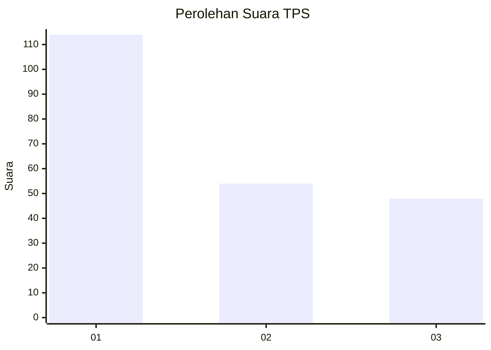
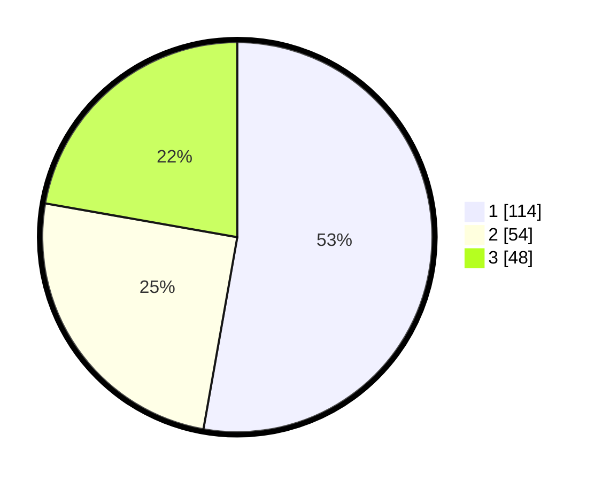

# Hasil

## Grafik

## Tabel

| No. | Nama Paslon    | Suara | Suara (raw) | Persentase |
|:--- |:-------------- | -----:| -----------:| ----------:|
| 1   | ANIES MUHAIMIN | 114   | [114][p-1]  | 52,78      |
| 2   | PRABOWO GIBRAN | 54    | [54][p-2]   | 25,00      |
| 3   | GANJAR MAHFUD  | 48    | [48][p-3]   | 22,22      |

[p-1]: https://github.com/gigit-pemilu/pemilu-2024-33-jawa-tengah/blob/main/pilpres/hitung-suara/sub/33-jawa-tengah/sub/75-kota-pekalongan/sub/03-pekalongan-utara/sub/1002-krapyak/sub/017-tps/sub/paslon-1.txt
[p-2]: https://github.com/gigit-pemilu/pemilu-2024-33-jawa-tengah/blob/main/pilpres/hitung-suara/sub/33-jawa-tengah/sub/75-kota-pekalongan/sub/03-pekalongan-utara/sub/1002-krapyak/sub/017-tps/sub/paslon-2.txt
[p-3]: https://github.com/gigit-pemilu/pemilu-2024-33-jawa-tengah/blob/main/pilpres/hitung-suara/sub/33-jawa-tengah/sub/75-kota-pekalongan/sub/03-pekalongan-utara/sub/1002-krapyak/sub/017-tps/sub/paslon-3.txt

## Foto C Plano

https://sirekap-obj-formc.kpu.go.id/e8ef/pemilu/ppwp/33/75/03/10/02/3375031002017-20240215-003852--12932554-6321-4b10-9fa1-662ba71d3720.jpg

https://sirekap-obj-formc.kpu.go.id/e8ef/pemilu/ppwp/33/75/03/10/02/3375031002017-20240215-004049--868ce9cf-c0fe-490d-ae74-ccc9e20748dd.jpg

https://sirekap-obj-formc.kpu.go.id/e8ef/pemilu/ppwp/33/75/03/10/02/3375031002017-20240215-004248--8ed22e15-2610-4a19-9c38-6cbe9f02d1c5.jpg

## Metadata

| Key        | Value               |
| ---------- | ------------------- |
| Time Stamp | 2024-02-15 12:00:28 |

