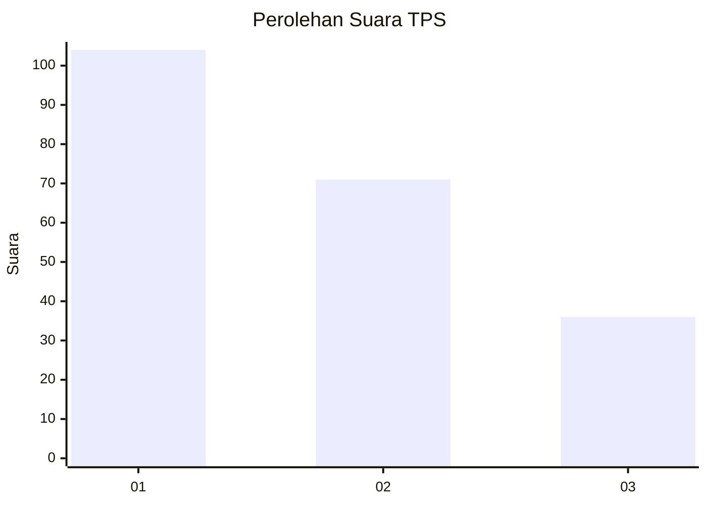
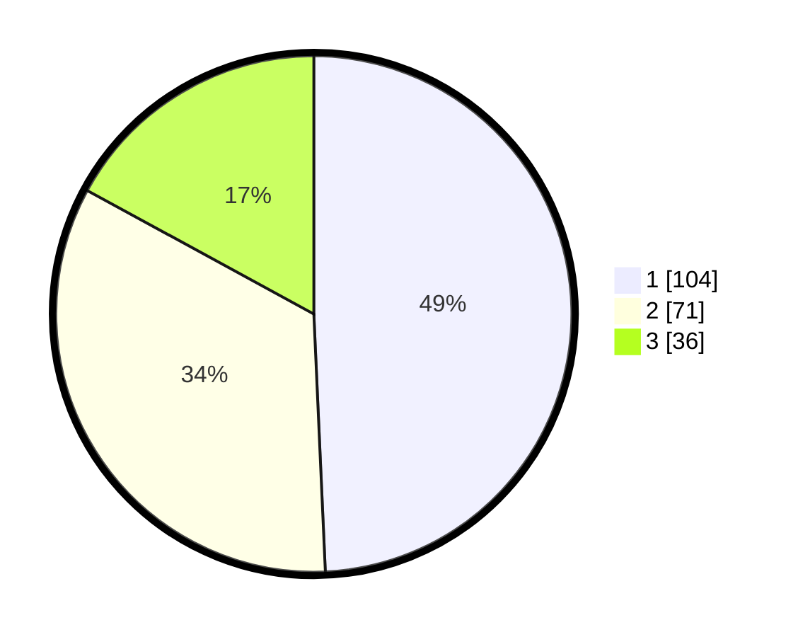

# Hasil

## Grafik

## Tabel

| No. | Nama Paslon    | Suara | Suara (raw) | Persentase |
|:--- |:-------------- | -----:| -----------:| ----------:|
| 1   | ANIES MUHAIMIN | 104   | [104][p-1]  | 49,29      |
| 2   | PRABOWO GIBRAN | 71    | [71][p-2]   | 33,65      |
| 3   | GANJAR MAHFUD  | 36    | [36][p-3]   | 17,06      |

[p-1]: https://github.com/gigit-pemilu/pemilu-2024/blob/main/pilpres/hitung-suara/sub/33-jawa-tengah/sub/75-kota-pekalongan/sub/03-pekalongan-utara/sub/1002-krapyak/sub/020-tps/sub/paslon-1.txt
[p-2]: https://github.com/gigit-pemilu/pemilu-2024/blob/main/pilpres/hitung-suara/sub/33-jawa-tengah/sub/75-kota-pekalongan/sub/03-pekalongan-utara/sub/1002-krapyak/sub/020-tps/sub/paslon-2.txt
[p-3]: https://github.com/gigit-pemilu/pemilu-2024/blob/main/pilpres/hitung-suara/sub/33-jawa-tengah/sub/75-kota-pekalongan/sub/03-pekalongan-utara/sub/1002-krapyak/sub/020-tps/sub/paslon-3.txt

## Foto C Plano

https://sirekap-obj-formc.kpu.go.id/b1e9/pemilu/ppwp/33/75/03/10/02/3375031002020-20240223-084027--72797179-1ba0-49ea-9b25-d983d7db9555.jpg

https://sirekap-obj-formc.kpu.go.id/b1e9/pemilu/ppwp/33/75/03/10/02/3375031002020-20240223-085702--e7a997c6-0ff1-4be9-a6d6-60fe947a0bd8.jpg

https://sirekap-obj-formc.kpu.go.id/b1e9/pemilu/ppwp/33/75/03/10/02/3375031002020-20240222-150926--27def6f5-1603-4da4-9df6-8faccf28f98e.jpg

## Metadata

| Key        | Value               |
| ---------- | ------------------- |
| Time Stamp | 2024-02-24 22:31:28 |

