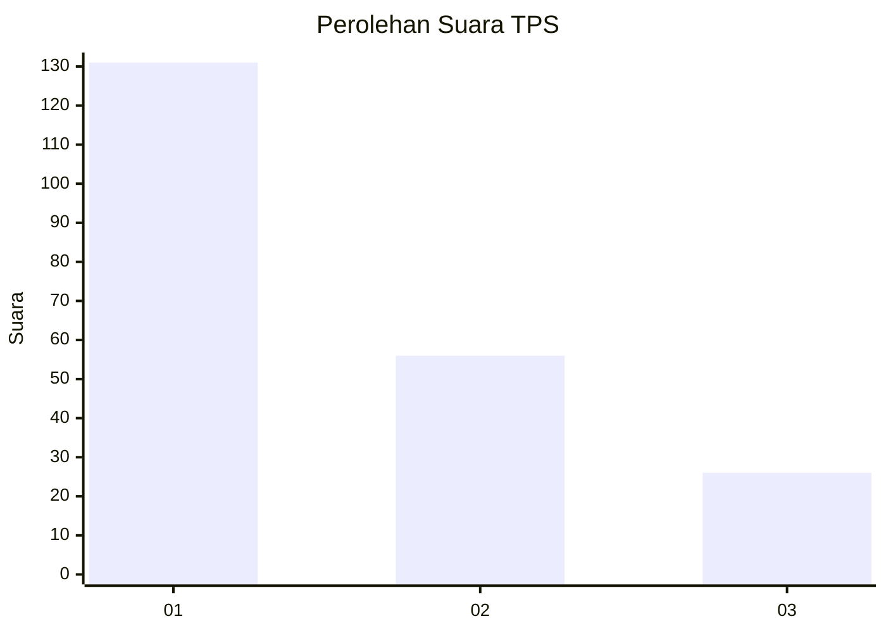
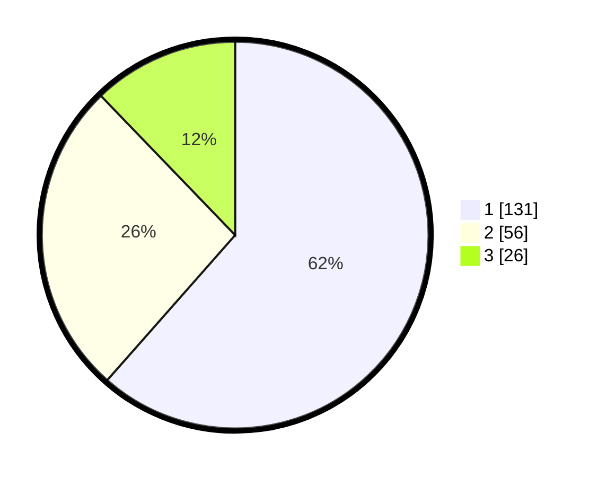

# Hasil

## Grafik

## Tabel

| No. | Nama Paslon    | Suara | Suara (raw) | Persentase |
|:--- |:-------------- | -----:| -----------:| ----------:|
| 1   | ANIES MUHAIMIN | 131   | [131][p-1]  | 61,50      |
| 2   | PRABOWO GIBRAN | 56    | [56][p-2]   | 26,29      |
| 3   | GANJAR MAHFUD  | 26    | [26][p-3]   | 12,21      |

[p-1]: https://github.com/gigit-pemilu/pemilu-2024-33-jawa-tengah/blob/main/pilpres/hitung-suara/sub/33-jawa-tengah/sub/75-kota-pekalongan/sub/03-pekalongan-utara/sub/1002-krapyak/sub/049-tps/sub/paslon-1.txt
[p-2]: https://github.com/gigit-pemilu/pemilu-2024-33-jawa-tengah/blob/main/pilpres/hitung-suara/sub/33-jawa-tengah/sub/75-kota-pekalongan/sub/03-pekalongan-utara/sub/1002-krapyak/sub/049-tps/sub/paslon-2.txt
[p-3]: https://github.com/gigit-pemilu/pemilu-2024-33-jawa-tengah/blob/main/pilpres/hitung-suara/sub/33-jawa-tengah/sub/75-kota-pekalongan/sub/03-pekalongan-utara/sub/1002-krapyak/sub/049-tps/sub/paslon-3.txt

## Foto C Plano

https://sirekap-obj-formc.kpu.go.id/f83d/pemilu/ppwp/33/75/03/10/02/3375031002049-20240215-110109--27489c14-a0d8-48c1-9210-36e9f8d4ae98.jpg

https://sirekap-obj-formc.kpu.go.id/f83d/pemilu/ppwp/33/75/03/10/02/3375031002049-20240215-033704--72eb6f8a-0d8f-4b7f-a930-b1c02f019aeb.jpg

https://sirekap-obj-formc.kpu.go.id/f83d/pemilu/ppwp/33/75/03/10/02/3375031002049-20240215-030102--d9d6b004-48be-437f-923e-0d40deb671b8.jpg

## Metadata

| Key        | Value               |
| ---------- | ------------------- |
| Time Stamp | 2024-02-15 18:00:26 |

