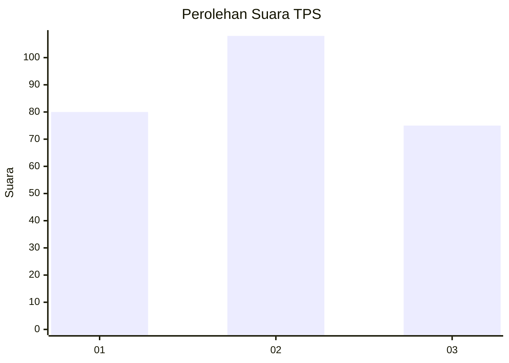
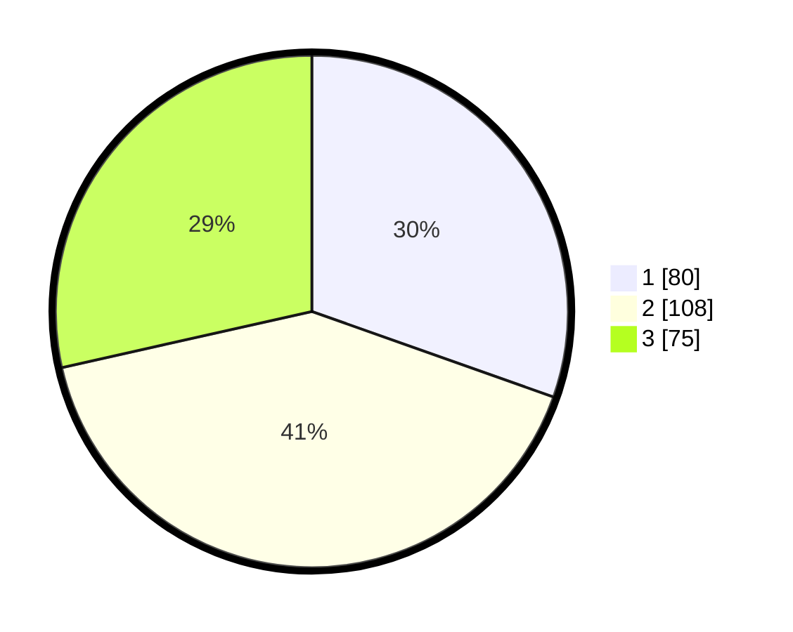

# Hasil

## Grafik

## Tabel

| No. | Nama Paslon    | Suara | Suara (raw) | Persentase |
|:--- |:-------------- | -----:| -----------:| ----------:|
| 1   | ANIES MUHAIMIN | 80    | [80][p-1]   | 30,42      |
| 2   | PRABOWO GIBRAN | 108   | [108][p-2]  | 41,06      |
| 3   | GANJAR MAHFUD  | 75    | [75][p-3]   | 28,52      |

[p-1]: https://github.com/gigit-pemilu/pemilu-2024/blob/main/pilpres/hitung-suara/sub/33-jawa-tengah/sub/75-kota-pekalongan/sub/03-pekalongan-utara/sub/1006-padukuhan-kraton/sub/018-tps/sub/paslon-1.txt
[p-2]: https://github.com/gigit-pemilu/pemilu-2024/blob/main/pilpres/hitung-suara/sub/33-jawa-tengah/sub/75-kota-pekalongan/sub/03-pekalongan-utara/sub/1006-padukuhan-kraton/sub/018-tps/sub/paslon-2.txt
[p-3]: https://github.com/gigit-pemilu/pemilu-2024/blob/main/pilpres/hitung-suara/sub/33-jawa-tengah/sub/75-kota-pekalongan/sub/03-pekalongan-utara/sub/1006-padukuhan-kraton/sub/018-tps/sub/paslon-3.txt

## Foto C Plano

https://sirekap-obj-formc.kpu.go.id/ffcd/pemilu/ppwp/33/75/03/10/06/3375031006018-20240225-094620--d411d5f0-fc85-495e-8a47-1e612996c378.jpg

https://sirekap-obj-formc.kpu.go.id/ffcd/pemilu/ppwp/33/75/03/10/06/3375031006018-20240225-094648--d42c7d80-0553-4a0e-ab68-cdcabbdd5fc9.jpg

https://sirekap-obj-formc.kpu.go.id/ffcd/pemilu/ppwp/33/75/03/10/06/3375031006018-20240225-094741--d9cf7188-1788-425d-8efa-fea665f32a6c.jpg

## Metadata

| Key        | Value               |
| ---------- | ------------------- |
| Time Stamp | 2024-02-25 10:00:00 |

