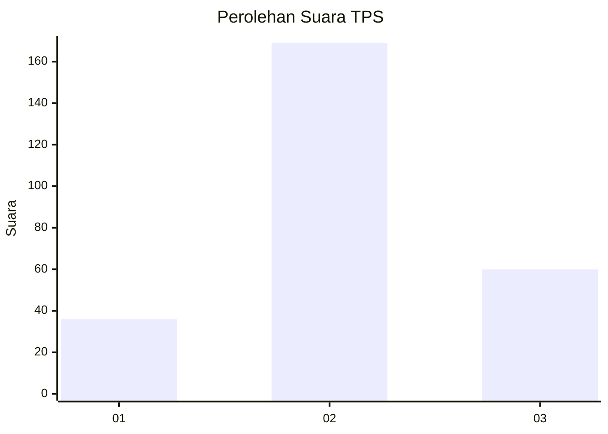
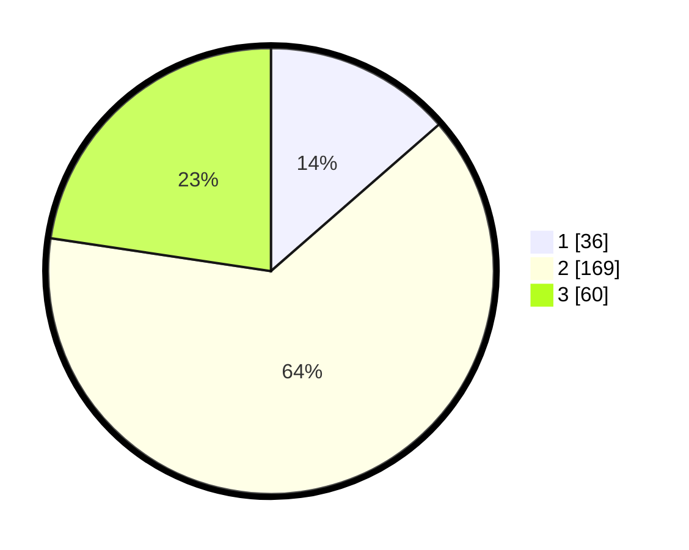

# Hasil

## Grafik

## Tabel

| No. | Nama Paslon    | Suara | Suara (raw) | Persentase |
|:--- |:-------------- | -----:| -----------:| ----------:|
| 1   | ANIES MUHAIMIN | 36    | [36][p-1]   | 13,58      |
| 2   | PRABOWO GIBRAN | 169   | [169][p-2]  | 63,77      |
| 3   | GANJAR MAHFUD  | 60    | [60][p-3]   | 22,64      |

[p-1]: https://github.com/gigit-pemilu/pemilu-2024-33-jawa-tengah/blob/main/pilpres/hitung-suara/sub/33-jawa-tengah/sub/75-kota-pekalongan/sub/03-pekalongan-utara/sub/1007-degayu/sub/006-tps/sub/paslon-1.txt
[p-2]: https://github.com/gigit-pemilu/pemilu-2024-33-jawa-tengah/blob/main/pilpres/hitung-suara/sub/33-jawa-tengah/sub/75-kota-pekalongan/sub/03-pekalongan-utara/sub/1007-degayu/sub/006-tps/sub/paslon-2.txt
[p-3]: https://github.com/gigit-pemilu/pemilu-2024-33-jawa-tengah/blob/main/pilpres/hitung-suara/sub/33-jawa-tengah/sub/75-kota-pekalongan/sub/03-pekalongan-utara/sub/1007-degayu/sub/006-tps/sub/paslon-3.txt

## Foto C Plano

https://sirekap-obj-formc.kpu.go.id/966e/pemilu/ppwp/33/75/03/10/07/3375031007006-20240225-102056--de358985-cd9b-43ee-b6dc-f3c3920e870a.jpg

https://sirekap-obj-formc.kpu.go.id/966e/pemilu/ppwp/33/75/03/10/07/3375031007006-20240225-102128--7d68f736-f5a8-4a15-95c8-4baf57a24a95.jpg

https://sirekap-obj-formc.kpu.go.id/966e/pemilu/ppwp/33/75/03/10/07/3375031007006-20240225-102202--31e7b2d9-9e11-4fe3-af62-ac3c5ca6bbfb.jpg

## Metadata

| Key        | Value               |
| ---------- | ------------------- |
| Time Stamp | 2024-02-25 11:00:00 |

