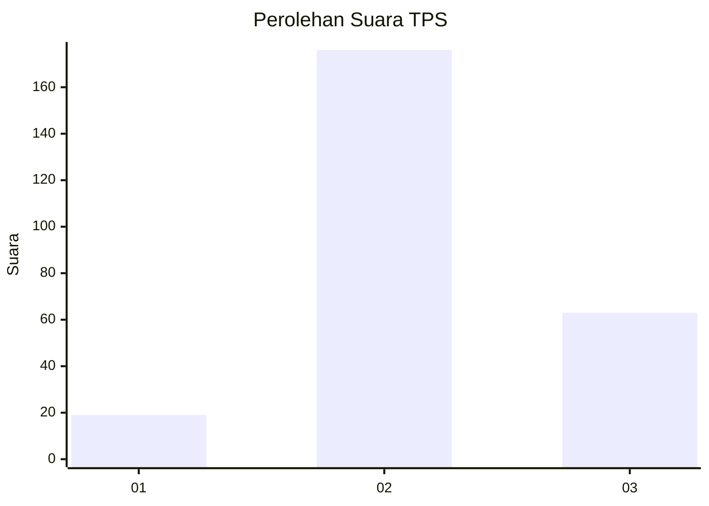
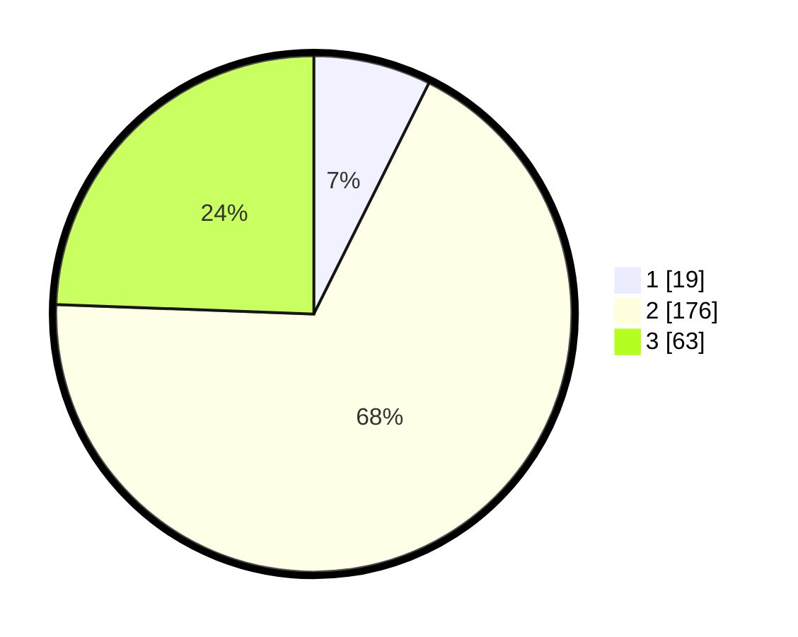

# Hasil

## Grafik

## Tabel

| No. | Nama Paslon    | Suara | Suara (raw) | Persentase |
|:--- |:-------------- | -----:| -----------:| ----------:|
| 1   | ANIES MUHAIMIN | 19    | [19][p-1]   | 7,36       |
| 2   | PRABOWO GIBRAN | 176   | [176][p-2]  | 68,22      |
| 3   | GANJAR MAHFUD  | 63    | [63][p-3]   | 24,42      |

[p-1]: https://github.com/gigit-pemilu/pemilu-2024-33-jawa-tengah/blob/main/pilpres/hitung-suara/sub/33-jawa-tengah/sub/75-kota-pekalongan/sub/03-pekalongan-utara/sub/1007-degayu/sub/007-tps/sub/paslon-1.txt
[p-2]: https://github.com/gigit-pemilu/pemilu-2024-33-jawa-tengah/blob/main/pilpres/hitung-suara/sub/33-jawa-tengah/sub/75-kota-pekalongan/sub/03-pekalongan-utara/sub/1007-degayu/sub/007-tps/sub/paslon-2.txt
[p-3]: https://github.com/gigit-pemilu/pemilu-2024-33-jawa-tengah/blob/main/pilpres/hitung-suara/sub/33-jawa-tengah/sub/75-kota-pekalongan/sub/03-pekalongan-utara/sub/1007-degayu/sub/007-tps/sub/paslon-3.txt

## Foto C Plano

https://sirekap-obj-formc.kpu.go.id/320c/pemilu/ppwp/33/75/03/10/07/3375031007007-20240214-214153--b9a9f024-68f4-482b-b2f7-da26cdd650c9.jpg

https://sirekap-obj-formc.kpu.go.id/320c/pemilu/ppwp/33/75/03/10/07/3375031007007-20240214-193527--87a9b722-aca2-4466-a94d-1ffe8b486ef8.jpg

https://sirekap-obj-formc.kpu.go.id/320c/pemilu/ppwp/33/75/03/10/07/3375031007007-20240214-193426--10d934a6-da13-49f0-b98f-2eed88357d9f.jpg

## Metadata

| Key        | Value               |
| ---------- | ------------------- |
| Time Stamp | 2024-02-14 21:46:01 |

