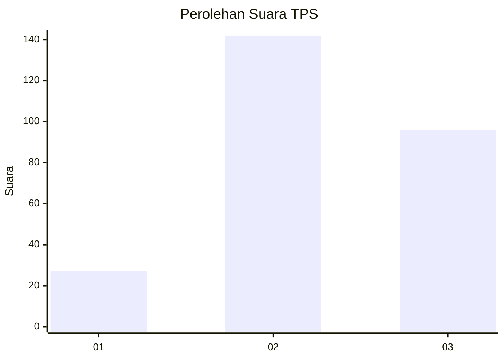
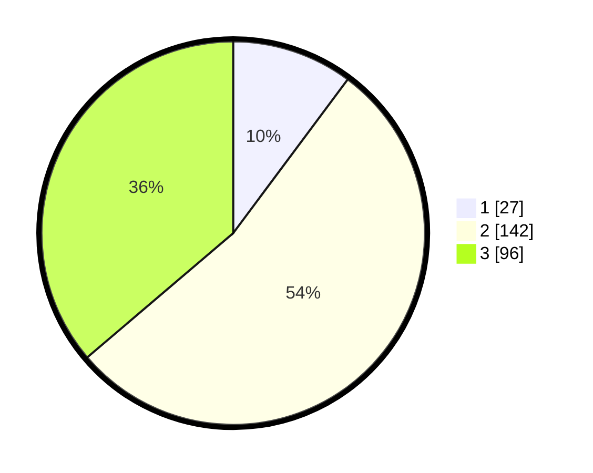

# Hasil

## Grafik

## Tabel

| No. | Nama Paslon    | Suara | Suara (raw) | Persentase |
|:--- |:-------------- | -----:| -----------:| ----------:|
| 1   | ANIES MUHAIMIN | 27    | [27][p-1]   | 10,19      |
| 2   | PRABOWO GIBRAN | 142   | [142][p-2]  | 53,58      |
| 3   | GANJAR MAHFUD  | 96    | [96][p-3]   | 36,23      |

[p-1]: https://github.com/gigit-pemilu/pemilu-2024-33-jawa-tengah/blob/main/pilpres/hitung-suara/sub/33-jawa-tengah/sub/75-kota-pekalongan/sub/03-pekalongan-utara/sub/1007-degayu/sub/009-tps/sub/paslon-1.txt
[p-2]: https://github.com/gigit-pemilu/pemilu-2024-33-jawa-tengah/blob/main/pilpres/hitung-suara/sub/33-jawa-tengah/sub/75-kota-pekalongan/sub/03-pekalongan-utara/sub/1007-degayu/sub/009-tps/sub/paslon-2.txt
[p-3]: https://github.com/gigit-pemilu/pemilu-2024-33-jawa-tengah/blob/main/pilpres/hitung-suara/sub/33-jawa-tengah/sub/75-kota-pekalongan/sub/03-pekalongan-utara/sub/1007-degayu/sub/009-tps/sub/paslon-3.txt

## Foto C Plano

https://sirekap-obj-formc.kpu.go.id/e83d/pemilu/ppwp/33/75/03/10/07/3375031007009-20240222-104746--c45cb4a0-28a6-4a84-8820-7bcfc2493a4e.jpg

https://sirekap-obj-formc.kpu.go.id/e83d/pemilu/ppwp/33/75/03/10/07/3375031007009-20240222-104810--893e8b99-f22b-4ed0-8b5d-806a047ec67a.jpg

https://sirekap-obj-formc.kpu.go.id/e83d/pemilu/ppwp/33/75/03/10/07/3375031007009-20240222-104830--273f9353-6736-418b-a0bb-bd708407764f.jpg

## Metadata

| Key        | Value               |
| ---------- | ------------------- |
| Time Stamp | 2024-02-22 12:00:00 |

