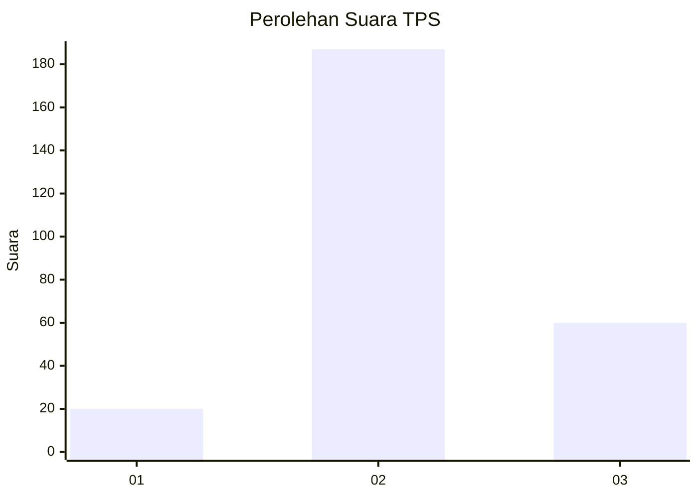
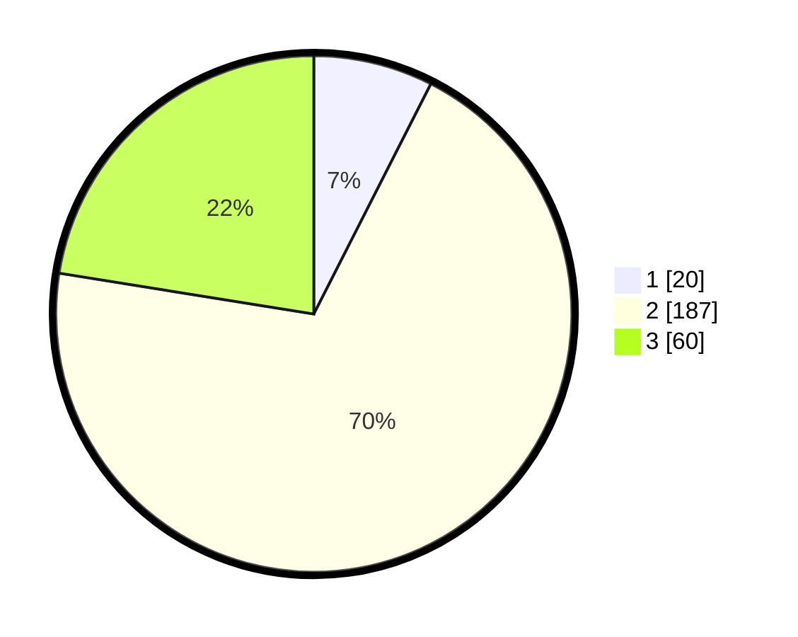

# Hasil

## Grafik

## Tabel

| No. | Nama Paslon    | Suara | Suara (raw) | Persentase |
|:--- |:-------------- | -----:| -----------:| ----------:|
| 1   | ANIES MUHAIMIN | 20    | [20][p-1]   | 7,49       |
| 2   | PRABOWO GIBRAN | 187   | [187][p-2]  | 70,04      |
| 3   | GANJAR MAHFUD  | 60    | [60][p-3]   | 22,47      |

[p-1]: https://github.com/gigit-pemilu/pemilu-2024-33-jawa-tengah/blob/main/pilpres/hitung-suara/sub/33-jawa-tengah/sub/75-kota-pekalongan/sub/03-pekalongan-utara/sub/1007-degayu/sub/012-tps/sub/paslon-1.txt
[p-2]: https://github.com/gigit-pemilu/pemilu-2024-33-jawa-tengah/blob/main/pilpres/hitung-suara/sub/33-jawa-tengah/sub/75-kota-pekalongan/sub/03-pekalongan-utara/sub/1007-degayu/sub/012-tps/sub/paslon-2.txt
[p-3]: https://github.com/gigit-pemilu/pemilu-2024-33-jawa-tengah/blob/main/pilpres/hitung-suara/sub/33-jawa-tengah/sub/75-kota-pekalongan/sub/03-pekalongan-utara/sub/1007-degayu/sub/012-tps/sub/paslon-3.txt

## Foto C Plano

https://sirekap-obj-formc.kpu.go.id/ab71/pemilu/ppwp/33/75/03/10/07/3375031007012-20240214-210844--f1300fbb-1e52-4388-8ed5-b15a0d72ff7f.jpg

https://sirekap-obj-formc.kpu.go.id/ab71/pemilu/ppwp/33/75/03/10/07/3375031007012-20240214-210626--6e800fc5-0f7c-4e53-a00c-5daf941a6012.jpg

https://sirekap-obj-formc.kpu.go.id/ab71/pemilu/ppwp/33/75/03/10/07/3375031007012-20240214-155737--569b851c-459b-41e2-8480-3d0278577e5e.jpg

## Metadata

| Key        | Value               |
| ---------- | ------------------- |
| Time Stamp | 2024-02-15 00:41:44 |

