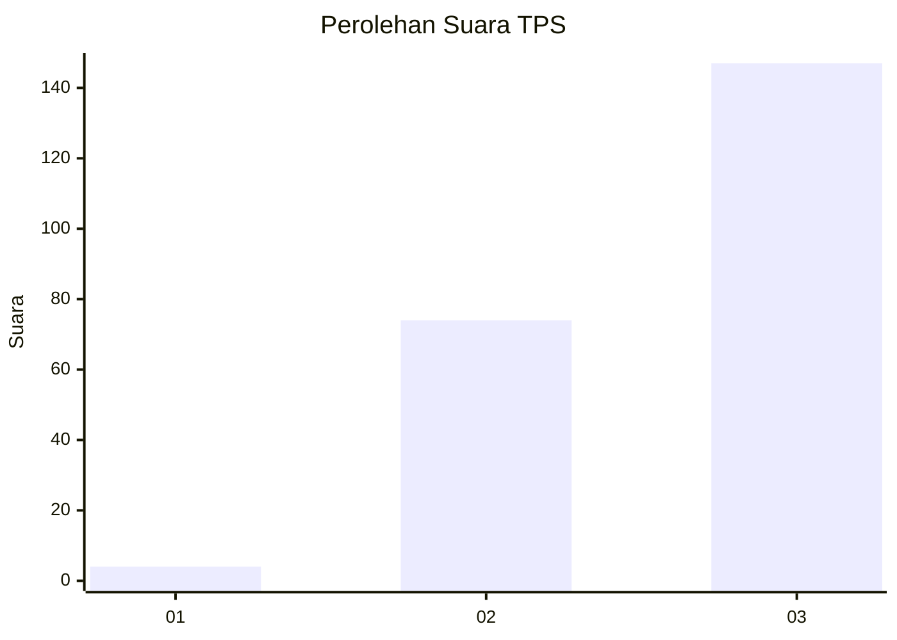
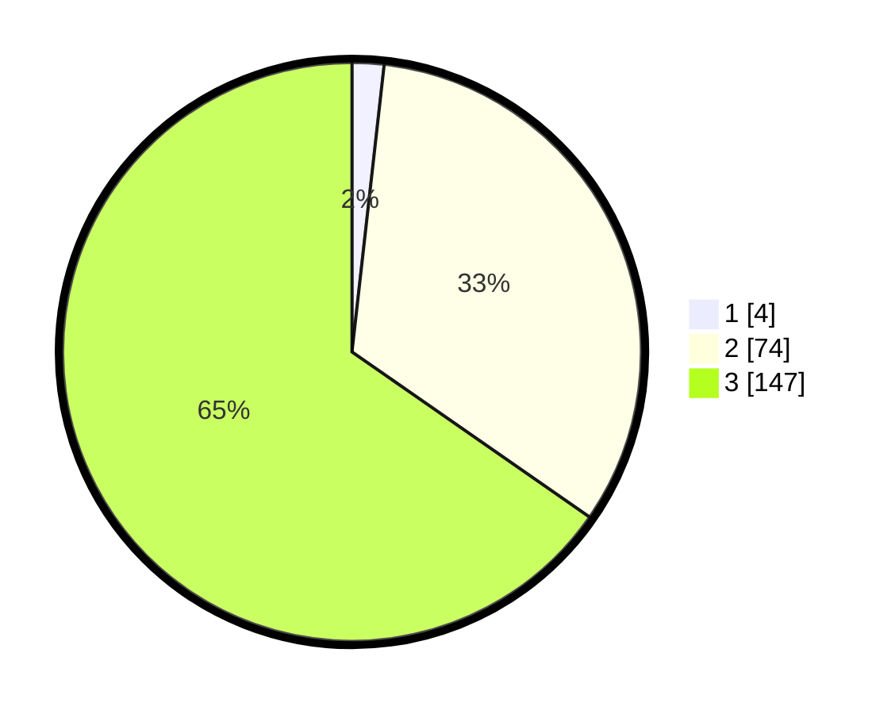

# Hasil

## Grafik

## Tabel

| No. | Nama Paslon    | Suara | Suara (raw) | Persentase |
|:--- |:-------------- | -----:| -----------:| ----------:|
| 1   | ANIES MUHAIMIN | 4     | [4][p-1]    | 1,78       |
| 2   | PRABOWO GIBRAN | 74    | [74][p-2]   | 32,89      |
| 3   | GANJAR MAHFUD  | 147   | [147][p-3]  | 65,33      |

[p-1]: https://github.com/gigit-pemilu/pemilu-2024-33-jawa-tengah/blob/main/pilpres/hitung-suara/sub/33-jawa-tengah/sub/75-kota-pekalongan/sub/03-pekalongan-utara/sub/1009-bandengan/sub/009-tps/sub/paslon-1.txt
[p-2]: https://github.com/gigit-pemilu/pemilu-2024-33-jawa-tengah/blob/main/pilpres/hitung-suara/sub/33-jawa-tengah/sub/75-kota-pekalongan/sub/03-pekalongan-utara/sub/1009-bandengan/sub/009-tps/sub/paslon-2.txt
[p-3]: https://github.com/gigit-pemilu/pemilu-2024-33-jawa-tengah/blob/main/pilpres/hitung-suara/sub/33-jawa-tengah/sub/75-kota-pekalongan/sub/03-pekalongan-utara/sub/1009-bandengan/sub/009-tps/sub/paslon-3.txt

## Foto C Plano

https://sirekap-obj-formc.kpu.go.id/3422/pemilu/ppwp/33/75/03/10/09/3375031009009-20240215-000826--b7fee2fb-3387-4260-a6ad-8390cc614419.jpg

https://sirekap-obj-formc.kpu.go.id/3422/pemilu/ppwp/33/75/03/10/09/3375031009009-20240214-201101--94e8a10a-7615-445b-ba2e-759c41ecf168.jpg

https://sirekap-obj-formc.kpu.go.id/3422/pemilu/ppwp/33/75/03/10/09/3375031009009-20240214-201012--a187f99a-bba7-4567-a8ea-af3c3481984a.jpg

## Metadata

| Key        | Value               |
| ---------- | ------------------- |
| Time Stamp | 2024-02-15 19:30:26 |

