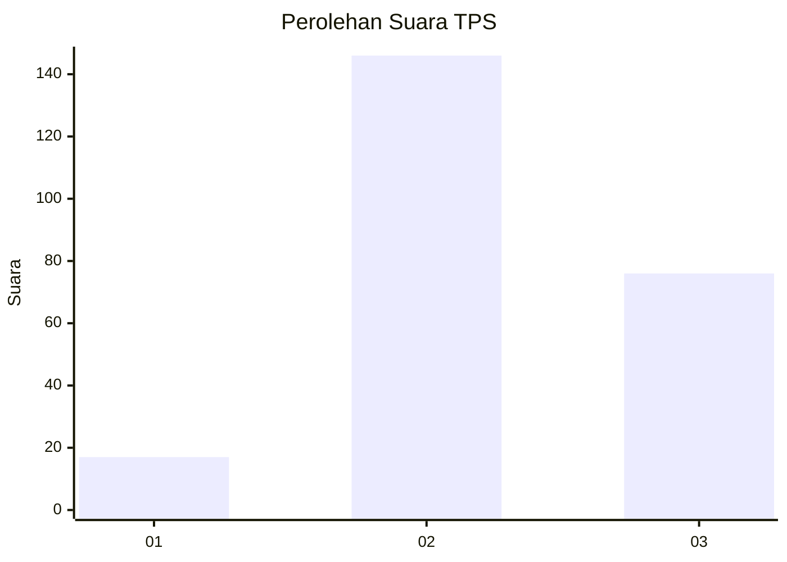
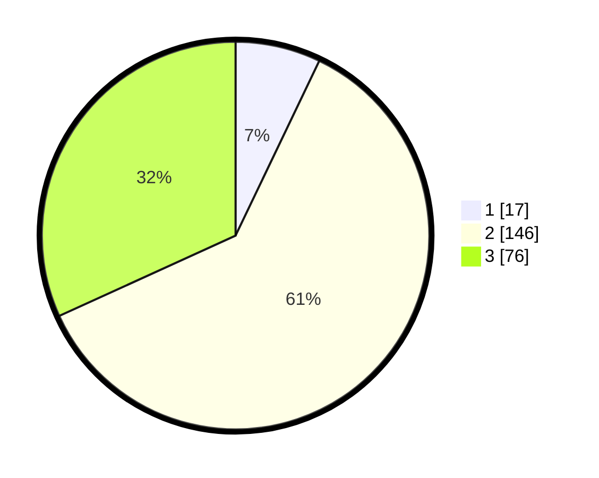

# Hasil

## Grafik

## Tabel

| No. | Nama Paslon    | Suara | Suara (raw) | Persentase |
|:--- |:-------------- | -----:| -----------:| ----------:|
| 1   | ANIES MUHAIMIN | 17    | [17][p-1]   | 7,11       |
| 2   | PRABOWO GIBRAN | 146   | [146][p-2]  | 61,09      |
| 3   | GANJAR MAHFUD  | 76    | [76][p-3]   | 31,80      |

[p-1]: https://github.com/gigit-pemilu/pemilu-2024/blob/main/pilpres/hitung-suara/sub/33-jawa-tengah/sub/75-kota-pekalongan/sub/04-pekalongan-selatan/sub/1002-banyurip/sub/002-tps/sub/paslon-1.txt
[p-2]: https://github.com/gigit-pemilu/pemilu-2024/blob/main/pilpres/hitung-suara/sub/33-jawa-tengah/sub/75-kota-pekalongan/sub/04-pekalongan-selatan/sub/1002-banyurip/sub/002-tps/sub/paslon-2.txt
[p-3]: https://github.com/gigit-pemilu/pemilu-2024/blob/main/pilpres/hitung-suara/sub/33-jawa-tengah/sub/75-kota-pekalongan/sub/04-pekalongan-selatan/sub/1002-banyurip/sub/002-tps/sub/paslon-3.txt

## Foto C Plano

https://sirekap-obj-formc.kpu.go.id/44ff/pemilu/ppwp/33/75/04/10/02/3375041002002-20240217-115455--8df1a451-f6fd-4dd8-a2ac-bb8ed61daac3.jpg

https://sirekap-obj-formc.kpu.go.id/44ff/pemilu/ppwp/33/75/04/10/02/3375041002002-20240217-120524--3c06b6b6-7054-4e87-8598-169789337f59.jpg

https://sirekap-obj-formc.kpu.go.id/44ff/pemilu/ppwp/33/75/04/10/02/3375041002002-20240215-015900--e5f9a587-8693-4615-94b5-17530d3497be.jpg

## Metadata

| Key        | Value               |
| ---------- | ------------------- |
| Time Stamp | 2024-02-19 10:00:00 |

