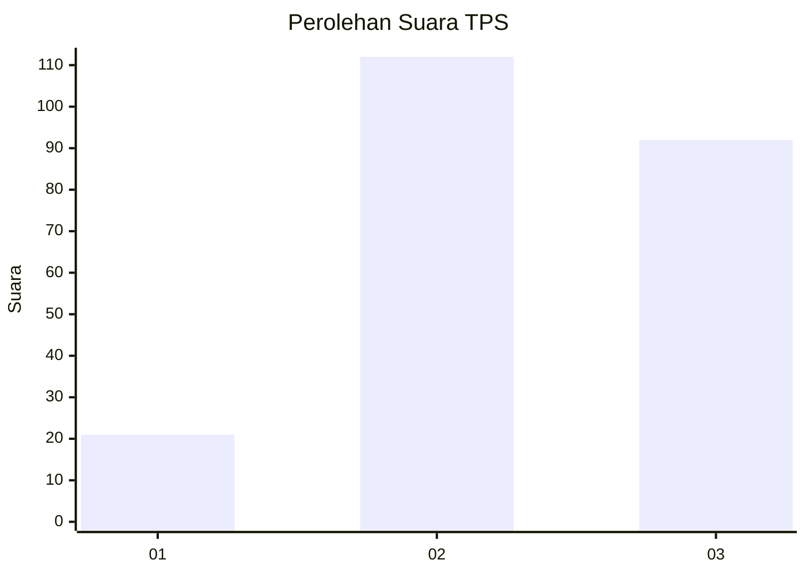
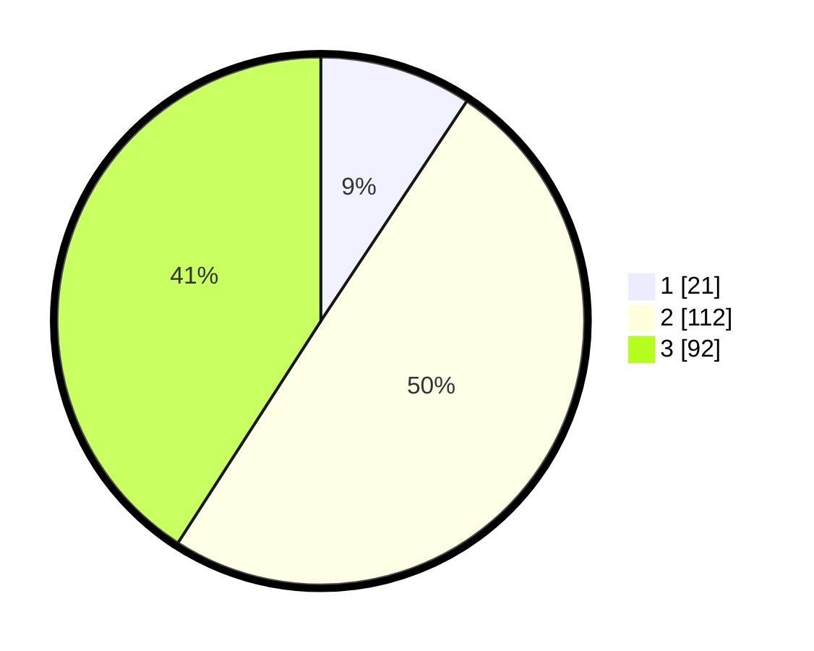

# Hasil

## Grafik

## Tabel

| No. | Nama Paslon    | Suara | Suara (raw) | Persentase |
|:--- |:-------------- | -----:| -----------:| ----------:|
| 1   | ANIES MUHAIMIN | 21    | [21][p-1]   | 9,33       |
| 2   | PRABOWO GIBRAN | 112   | [112][p-2]  | 49,78      |
| 3   | GANJAR MAHFUD  | 92    | [92][p-3]   | 40,89      |

[p-1]: https://github.com/gigit-pemilu/pemilu-2024/blob/main/pilpres/hitung-suara/sub/33-jawa-tengah/sub/75-kota-pekalongan/sub/04-pekalongan-selatan/sub/1002-banyurip/sub/003-tps/sub/paslon-1.txt
[p-2]: https://github.com/gigit-pemilu/pemilu-2024/blob/main/pilpres/hitung-suara/sub/33-jawa-tengah/sub/75-kota-pekalongan/sub/04-pekalongan-selatan/sub/1002-banyurip/sub/003-tps/sub/paslon-2.txt
[p-3]: https://github.com/gigit-pemilu/pemilu-2024/blob/main/pilpres/hitung-suara/sub/33-jawa-tengah/sub/75-kota-pekalongan/sub/04-pekalongan-selatan/sub/1002-banyurip/sub/003-tps/sub/paslon-3.txt

## Foto C Plano

https://sirekap-obj-formc.kpu.go.id/0e27/pemilu/ppwp/33/75/04/10/02/3375041002003-20240214-220127--c3435e00-bce5-44bf-97a3-c1583219daae.jpg

https://sirekap-obj-formc.kpu.go.id/0e27/pemilu/ppwp/33/75/04/10/02/3375041002003-20240214-220216--5b1fbf08-7774-4b42-92e6-f684827fc8af.jpg

https://sirekap-obj-formc.kpu.go.id/0e27/pemilu/ppwp/33/75/04/10/02/3375041002003-20240214-220255--abb529d2-e624-4867-bc29-09a568c468f8.jpg

## Metadata

| Key        | Value               |
| ---------- | ------------------- |
| Time Stamp | 2024-02-15 12:00:28 |

