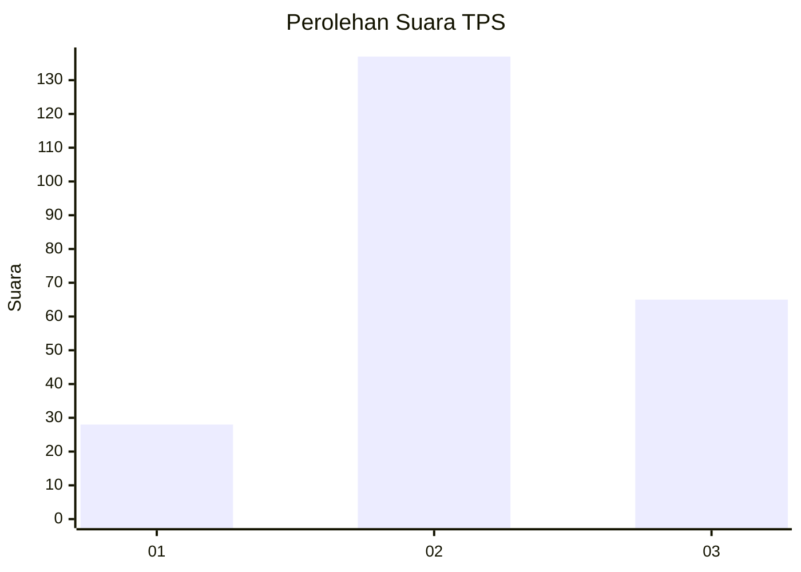
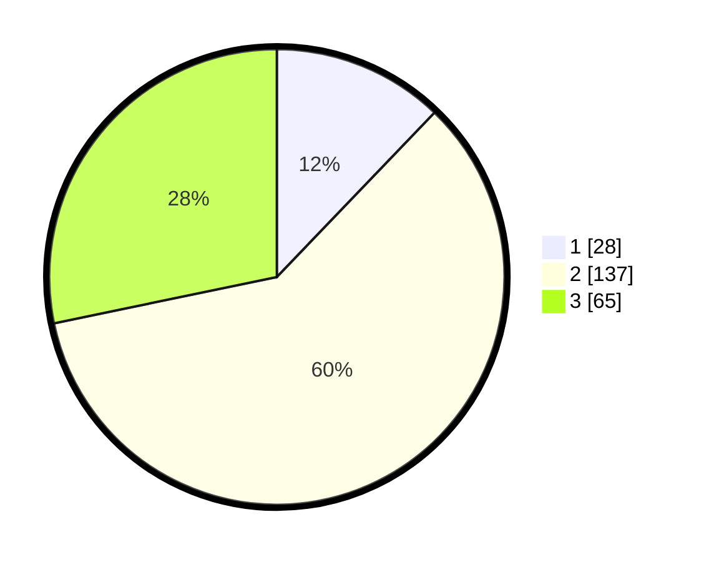

# Hasil

## Grafik

## Tabel

| No. | Nama Paslon    | Suara | Suara (raw) | Persentase |
|:--- |:-------------- | -----:| -----------:| ----------:|
| 1   | ANIES MUHAIMIN | 28    | [28][p-1]   | 12,17      |
| 2   | PRABOWO GIBRAN | 137   | [137][p-2]  | 59,57      |
| 3   | GANJAR MAHFUD  | 65    | [65][p-3]   | 28,26      |

[p-1]: https://github.com/gigit-pemilu/pemilu-2024/blob/main/pilpres/hitung-suara/sub/33-jawa-tengah/sub/75-kota-pekalongan/sub/04-pekalongan-selatan/sub/1002-banyurip/sub/004-tps/sub/paslon-1.txt
[p-2]: https://github.com/gigit-pemilu/pemilu-2024/blob/main/pilpres/hitung-suara/sub/33-jawa-tengah/sub/75-kota-pekalongan/sub/04-pekalongan-selatan/sub/1002-banyurip/sub/004-tps/sub/paslon-2.txt
[p-3]: https://github.com/gigit-pemilu/pemilu-2024/blob/main/pilpres/hitung-suara/sub/33-jawa-tengah/sub/75-kota-pekalongan/sub/04-pekalongan-selatan/sub/1002-banyurip/sub/004-tps/sub/paslon-3.txt

## Foto C Plano

https://sirekap-obj-formc.kpu.go.id/ebbb/pemilu/ppwp/33/75/04/10/02/3375041002004-20240215-055212--ab7f1239-cf11-4e92-866b-a04fab06be8f.jpg

https://sirekap-obj-formc.kpu.go.id/ebbb/pemilu/ppwp/33/75/04/10/02/3375041002004-20240215-053708--77f624f3-483a-4ef4-875f-405899430622.jpg

https://sirekap-obj-formc.kpu.go.id/ebbb/pemilu/ppwp/33/75/04/10/02/3375041002004-20240215-053823--465b657b-c424-4e5e-a8a9-f1a4d4a0de9d.jpg

## Metadata

| Key        | Value               |
| ---------- | ------------------- |
| Time Stamp | 2024-02-15 22:00:27 |

