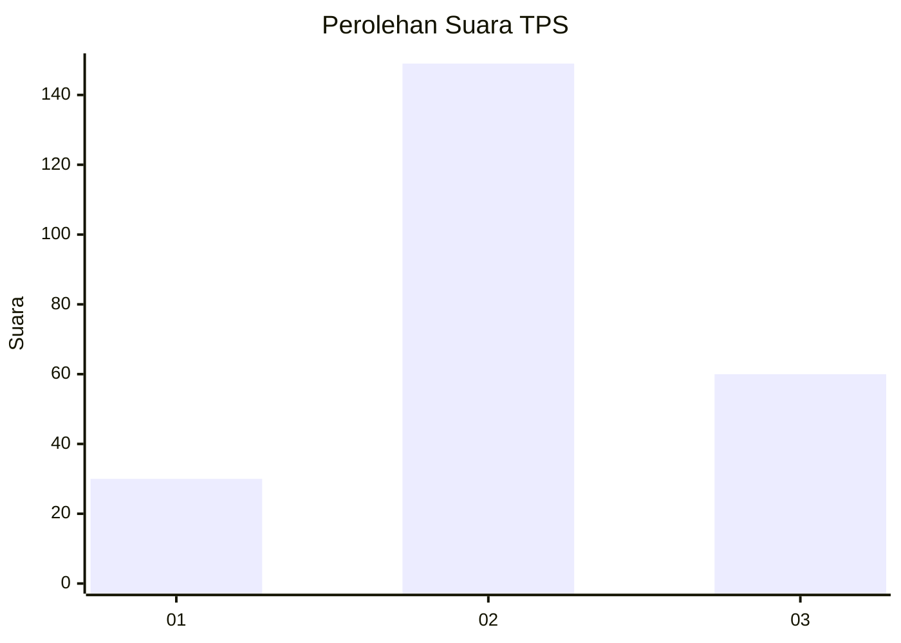
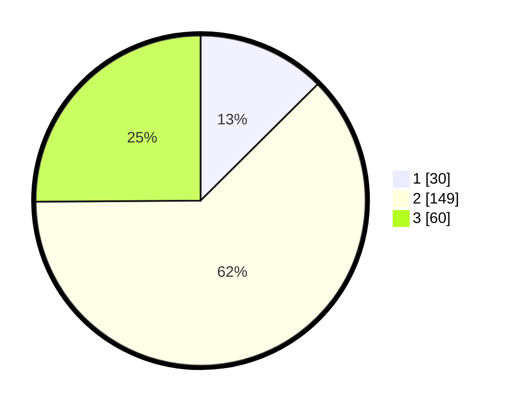

# Hasil

## Grafik

## Tabel

| No. | Nama Paslon    | Suara | Suara (raw) | Persentase |
|:--- |:-------------- | -----:| -----------:| ----------:|
| 1   | ANIES MUHAIMIN | 30    | [30][p-1]   | 12,55      |
| 2   | PRABOWO GIBRAN | 149   | [149][p-2]  | 62,34      |
| 3   | GANJAR MAHFUD  | 60    | [60][p-3]   | 25,10      |

[p-1]: https://github.com/gigit-pemilu/pemilu-2024/blob/main/pilpres/hitung-suara/sub/33-jawa-tengah/sub/75-kota-pekalongan/sub/04-pekalongan-selatan/sub/1002-banyurip/sub/005-tps/sub/paslon-1.txt
[p-2]: https://github.com/gigit-pemilu/pemilu-2024/blob/main/pilpres/hitung-suara/sub/33-jawa-tengah/sub/75-kota-pekalongan/sub/04-pekalongan-selatan/sub/1002-banyurip/sub/005-tps/sub/paslon-2.txt
[p-3]: https://github.com/gigit-pemilu/pemilu-2024/blob/main/pilpres/hitung-suara/sub/33-jawa-tengah/sub/75-kota-pekalongan/sub/04-pekalongan-selatan/sub/1002-banyurip/sub/005-tps/sub/paslon-3.txt

## Foto C Plano

https://sirekap-obj-formc.kpu.go.id/6f00/pemilu/ppwp/33/75/04/10/02/3375041002005-20240215-024517--d503d9ab-7eac-4254-8380-7e3f12121be1.jpg

https://sirekap-obj-formc.kpu.go.id/6f00/pemilu/ppwp/33/75/04/10/02/3375041002005-20240214-225031--b8bd05f2-04eb-46a3-be42-40e36fe0a303.jpg

https://sirekap-obj-formc.kpu.go.id/6f00/pemilu/ppwp/33/75/04/10/02/3375041002005-20240214-225717--a5292ff7-8d04-4215-86c2-39a32c412fca.jpg

## Metadata

| Key        | Value               |
| ---------- | ------------------- |
| Time Stamp | 2024-02-15 19:00:26 |

