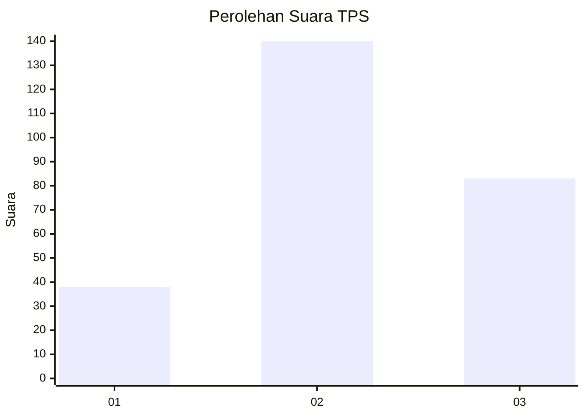
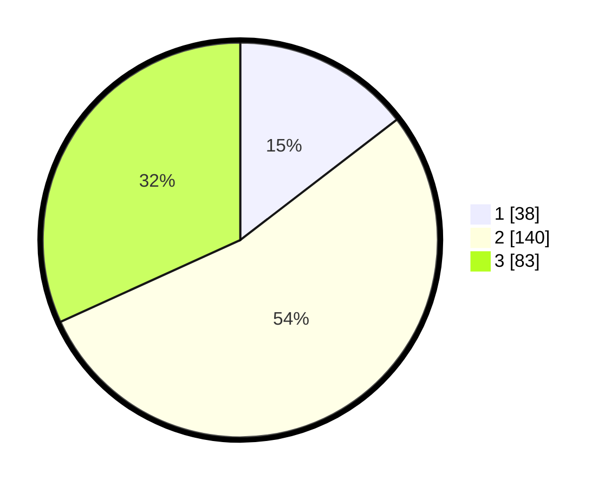

# Hasil

## Grafik

## Tabel

| No. | Nama Paslon    | Suara | Suara (raw) | Persentase |
|:--- |:-------------- | -----:| -----------:| ----------:|
| 1   | ANIES MUHAIMIN | 38    | [38][p-1]   | 14,56      |
| 2   | PRABOWO GIBRAN | 140   | [140][p-2]  | 53,64      |
| 3   | GANJAR MAHFUD  | 83    | [83][p-3]   | 31,80      |

[p-1]: https://github.com/gigit-pemilu/pemilu-2024-33-jawa-tengah/blob/main/pilpres/hitung-suara/sub/33-jawa-tengah/sub/75-kota-pekalongan/sub/04-pekalongan-selatan/sub/1003-buaran-kradenan/sub/005-tps/sub/paslon-1.txt
[p-2]: https://github.com/gigit-pemilu/pemilu-2024-33-jawa-tengah/blob/main/pilpres/hitung-suara/sub/33-jawa-tengah/sub/75-kota-pekalongan/sub/04-pekalongan-selatan/sub/1003-buaran-kradenan/sub/005-tps/sub/paslon-2.txt
[p-3]: https://github.com/gigit-pemilu/pemilu-2024-33-jawa-tengah/blob/main/pilpres/hitung-suara/sub/33-jawa-tengah/sub/75-kota-pekalongan/sub/04-pekalongan-selatan/sub/1003-buaran-kradenan/sub/005-tps/sub/paslon-3.txt

## Foto C Plano

https://sirekap-obj-formc.kpu.go.id/4b07/pemilu/ppwp/33/75/04/10/03/3375041003005-20240214-215035--e96b22c4-7a4d-49ec-b683-00dca0ad6531.jpg

https://sirekap-obj-formc.kpu.go.id/4b07/pemilu/ppwp/33/75/04/10/03/3375041003005-20240214-215200--259f6eb6-8902-42a5-a7ba-a2b162bc953c.jpg

https://sirekap-obj-formc.kpu.go.id/4b07/pemilu/ppwp/33/75/04/10/03/3375041003005-20240214-215421--f0941ad5-2afc-4b0b-97a5-85cfbe08fb58.jpg

## Metadata

| Key        | Value               |
| ---------- | ------------------- |
| Time Stamp | 2024-02-15 15:00:29 |

