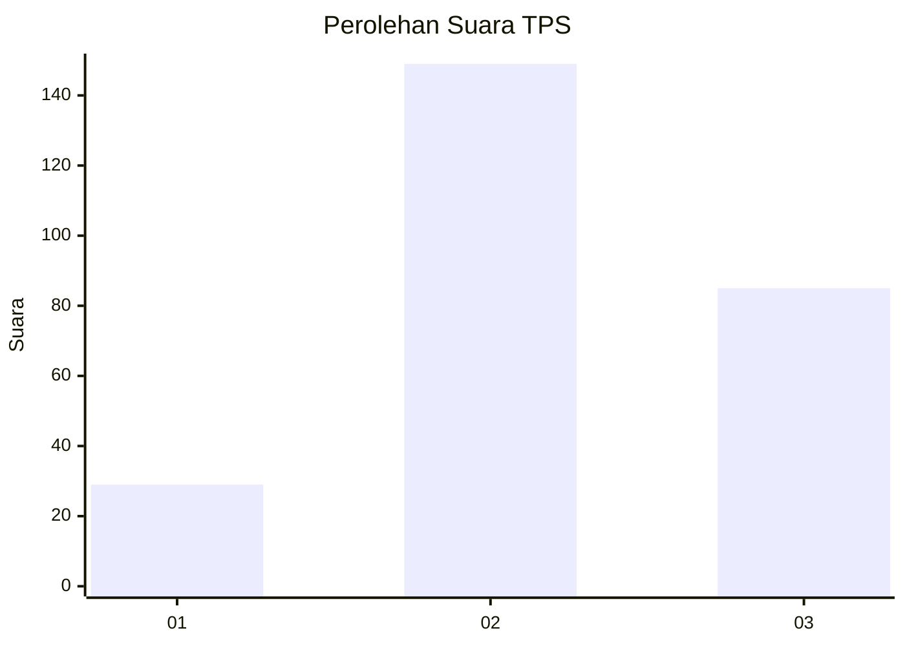
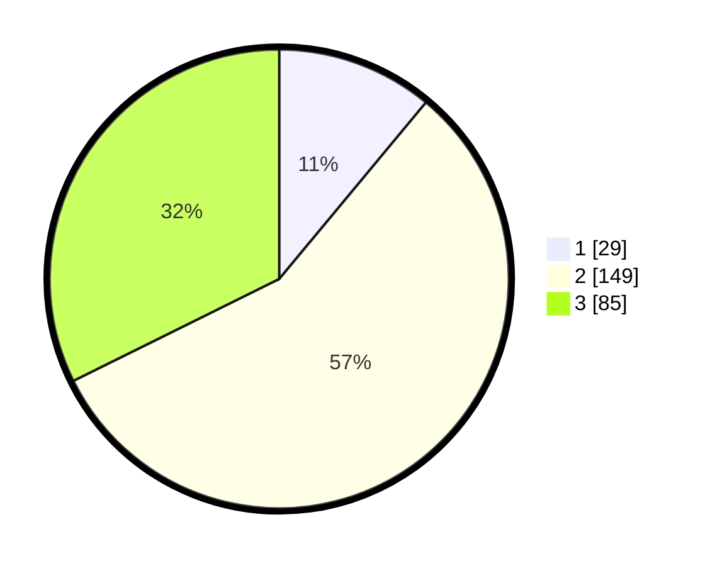

# Hasil

## Grafik

## Tabel

| No. | Nama Paslon    | Suara | Suara (raw) | Persentase |
|:--- |:-------------- | -----:| -----------:| ----------:|
| 1   | ANIES MUHAIMIN | 29    | [29][p-1]   | 11,03      |
| 2   | PRABOWO GIBRAN | 149   | [149][p-2]  | 56,65      |
| 3   | GANJAR MAHFUD  | 85    | [85][p-3]   | 32,32      |

[p-1]: https://github.com/gigit-pemilu/pemilu-2024/blob/main/pilpres/hitung-suara/sub/33-jawa-tengah/sub/75-kota-pekalongan/sub/04-pekalongan-selatan/sub/1003-buaran-kradenan/sub/007-tps/sub/paslon-1.txt
[p-2]: https://github.com/gigit-pemilu/pemilu-2024/blob/main/pilpres/hitung-suara/sub/33-jawa-tengah/sub/75-kota-pekalongan/sub/04-pekalongan-selatan/sub/1003-buaran-kradenan/sub/007-tps/sub/paslon-2.txt
[p-3]: https://github.com/gigit-pemilu/pemilu-2024/blob/main/pilpres/hitung-suara/sub/33-jawa-tengah/sub/75-kota-pekalongan/sub/04-pekalongan-selatan/sub/1003-buaran-kradenan/sub/007-tps/sub/paslon-3.txt

## Foto C Plano

https://sirekap-obj-formc.kpu.go.id/d033/pemilu/ppwp/33/75/04/10/03/3375041003007-20240223-202842--2370d4f5-7cd3-4cda-aabe-9ef740398f05.jpg

https://sirekap-obj-formc.kpu.go.id/d033/pemilu/ppwp/33/75/04/10/03/3375041003007-20240223-202902--a4ddb18b-9fa9-4bed-bb10-c20e97fe147f.jpg

https://sirekap-obj-formc.kpu.go.id/d033/pemilu/ppwp/33/75/04/10/03/3375041003007-20240223-202936--a8ec70a6-bb29-4837-94f2-a2a9c78775d0.jpg

## Metadata

| Key        | Value               |
| ---------- | ------------------- |
| Time Stamp | 2024-02-24 22:31:28 |

