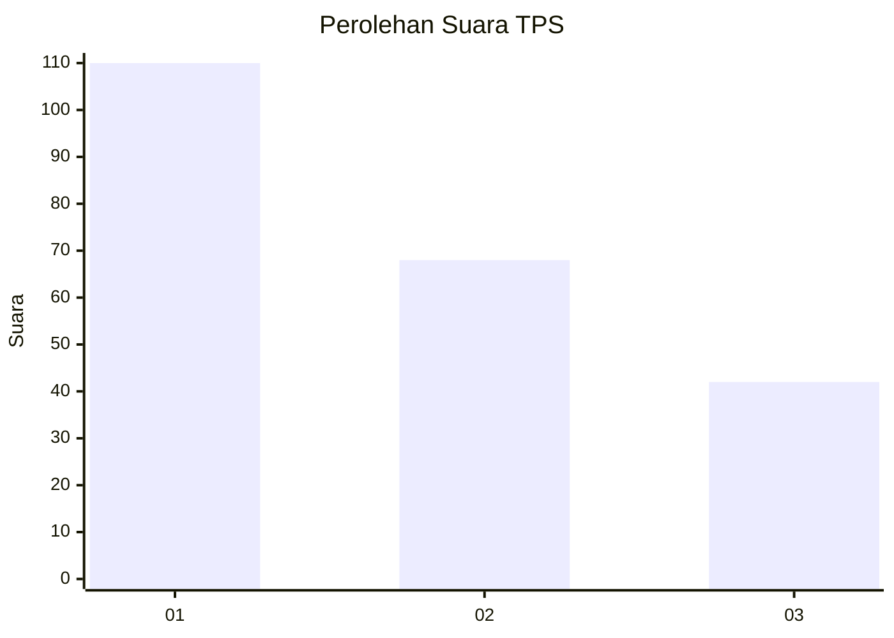
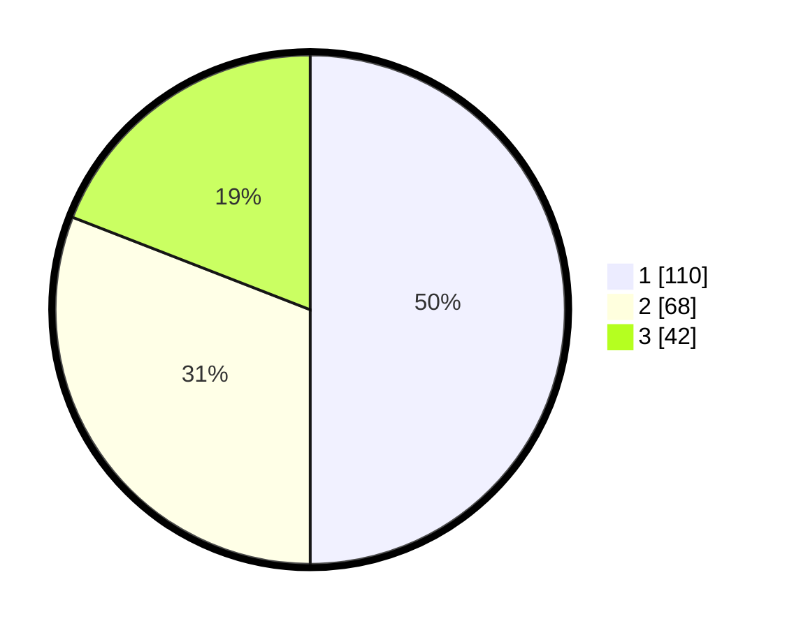

# Hasil

## Grafik

## Tabel

| No. | Nama Paslon    | Suara | Suara (raw) | Persentase |
|:--- |:-------------- | -----:| -----------:| ----------:|
| 1   | ANIES MUHAIMIN | 110   | [110][p-1]  | 50,00      |
| 2   | PRABOWO GIBRAN | 68    | [68][p-2]   | 30,91      |
| 3   | GANJAR MAHFUD  | 42    | [42][p-3]   | 19,09      |

[p-1]: https://github.com/gigit-pemilu/pemilu-2024-33-jawa-tengah/blob/main/pilpres/hitung-suara/sub/33-jawa-tengah/sub/75-kota-pekalongan/sub/04-pekalongan-selatan/sub/1003-buaran-kradenan/sub/017-tps/sub/paslon-1.txt
[p-2]: https://github.com/gigit-pemilu/pemilu-2024-33-jawa-tengah/blob/main/pilpres/hitung-suara/sub/33-jawa-tengah/sub/75-kota-pekalongan/sub/04-pekalongan-selatan/sub/1003-buaran-kradenan/sub/017-tps/sub/paslon-2.txt
[p-3]: https://github.com/gigit-pemilu/pemilu-2024-33-jawa-tengah/blob/main/pilpres/hitung-suara/sub/33-jawa-tengah/sub/75-kota-pekalongan/sub/04-pekalongan-selatan/sub/1003-buaran-kradenan/sub/017-tps/sub/paslon-3.txt

## Foto C Plano

https://sirekap-obj-formc.kpu.go.id/8b03/pemilu/ppwp/33/75/04/10/03/3375041003017-20240215-023058--d0427a6f-4f1f-4189-885d-21cea87c0d89.jpg

https://sirekap-obj-formc.kpu.go.id/8b03/pemilu/ppwp/33/75/04/10/03/3375041003017-20240215-023449--6928f6a5-c561-4585-be39-eee62cfbeefa.jpg

https://sirekap-obj-formc.kpu.go.id/8b03/pemilu/ppwp/33/75/04/10/03/3375041003017-20240215-023625--9e527658-d4e5-44bb-9081-07bdd7aeb610.jpg

## Metadata

| Key        | Value               |
| ---------- | ------------------- |
| Time Stamp | 2024-02-15 12:00:28 |

