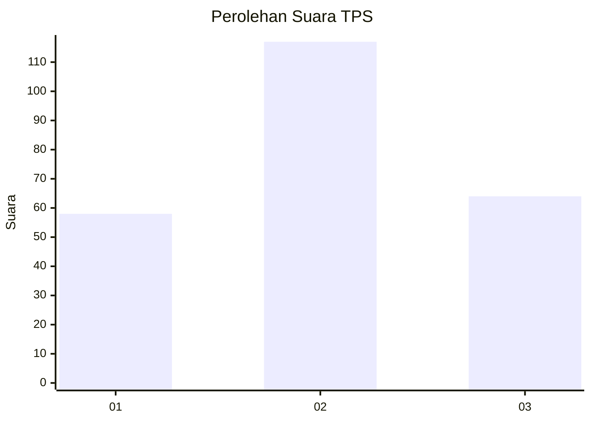
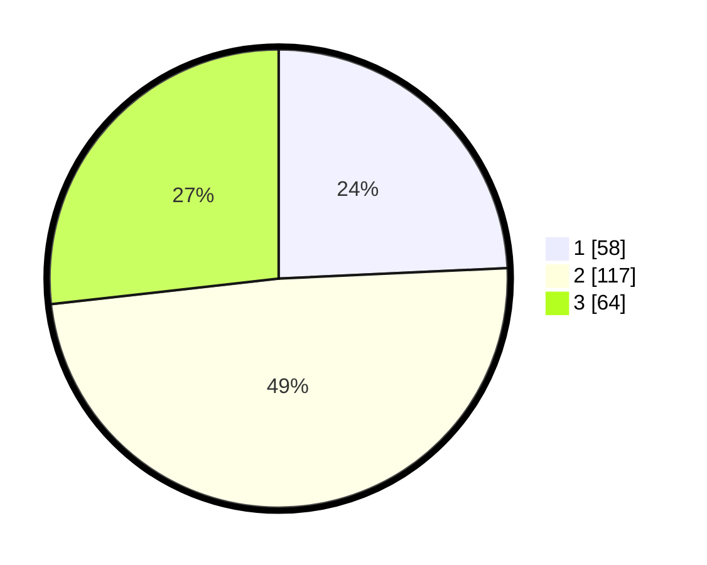

# Hasil

## Grafik

## Tabel

| No. | Nama Paslon    | Suara | Suara (raw) | Persentase |
|:--- |:-------------- | -----:| -----------:| ----------:|
| 1   | ANIES MUHAIMIN | 58    | [58][p-1]   | 24,27      |
| 2   | PRABOWO GIBRAN | 117   | [117][p-2]  | 48,95      |
| 3   | GANJAR MAHFUD  | 64    | [64][p-3]   | 26,78      |

[p-1]: https://github.com/gigit-pemilu/pemilu-2024/blob/main/pilpres/hitung-suara/sub/33-jawa-tengah/sub/76-kota-tegal/sub/01-tegal-barat/sub/1001-pesurungan-kidul/sub/004-tps/sub/paslon-1.txt
[p-2]: https://github.com/gigit-pemilu/pemilu-2024/blob/main/pilpres/hitung-suara/sub/33-jawa-tengah/sub/76-kota-tegal/sub/01-tegal-barat/sub/1001-pesurungan-kidul/sub/004-tps/sub/paslon-2.txt
[p-3]: https://github.com/gigit-pemilu/pemilu-2024/blob/main/pilpres/hitung-suara/sub/33-jawa-tengah/sub/76-kota-tegal/sub/01-tegal-barat/sub/1001-pesurungan-kidul/sub/004-tps/sub/paslon-3.txt

## Foto C Plano

https://sirekap-obj-formc.kpu.go.id/9d2c/pemilu/ppwp/33/76/01/10/01/3376011001004-20240214-212500--6c26f5a0-339a-45f9-8596-06ce3d574581.jpg

https://sirekap-obj-formc.kpu.go.id/9d2c/pemilu/ppwp/33/76/01/10/01/3376011001004-20240215-013810--40990c5c-041d-4eee-94fb-74b747f9f64e.jpg

https://sirekap-obj-formc.kpu.go.id/9d2c/pemilu/ppwp/33/76/01/10/01/3376011001004-20240214-212240--77fbf181-4ada-40ae-a4a4-7a0f93265121.jpg

## Metadata

| Key        | Value               |
| ---------- | ------------------- |
| Time Stamp | 2024-02-15 15:00:29 |

