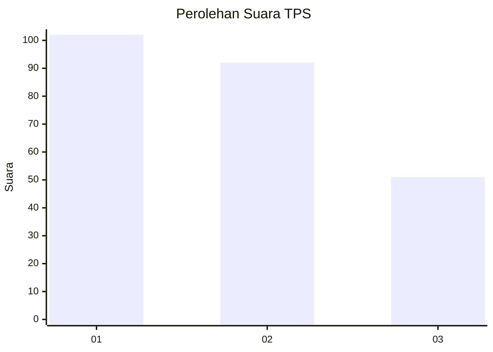
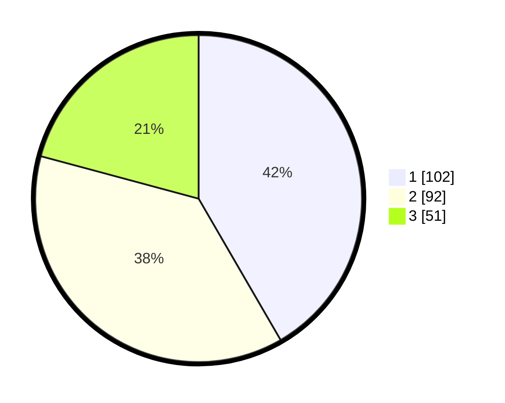

# Hasil

## Grafik

## Tabel

| No. | Nama Paslon    | Suara | Suara (raw) | Persentase |
|:--- |:-------------- | -----:| -----------:| ----------:|
| 1   | ANIES MUHAIMIN | 102   | [102][p-1]  | 41,63      |
| 2   | PRABOWO GIBRAN | 92    | [92][p-2]   | 37,55      |
| 3   | GANJAR MAHFUD  | 51    | [51][p-3]   | 20,82      |

[p-1]: https://github.com/gigit-pemilu/pemilu-2024-33-jawa-tengah/blob/main/pilpres/hitung-suara/sub/33-jawa-tengah/sub/76-kota-tegal/sub/03-tegal-selatan/sub/1007-debong-tengah/sub/008-tps/sub/paslon-1.txt
[p-2]: https://github.com/gigit-pemilu/pemilu-2024-33-jawa-tengah/blob/main/pilpres/hitung-suara/sub/33-jawa-tengah/sub/76-kota-tegal/sub/03-tegal-selatan/sub/1007-debong-tengah/sub/008-tps/sub/paslon-2.txt
[p-3]: https://github.com/gigit-pemilu/pemilu-2024-33-jawa-tengah/blob/main/pilpres/hitung-suara/sub/33-jawa-tengah/sub/76-kota-tegal/sub/03-tegal-selatan/sub/1007-debong-tengah/sub/008-tps/sub/paslon-3.txt

## Foto C Plano

https://sirekap-obj-formc.kpu.go.id/e774/pemilu/ppwp/33/76/03/10/07/3376031007008-20240215-053458--d5ba0bea-6f5c-4795-a856-92e5b1ba77ff.jpg

https://sirekap-obj-formc.kpu.go.id/e774/pemilu/ppwp/33/76/03/10/07/3376031007008-20240215-002253--f326b439-b35a-4fac-bab8-2d76a1cad48b.jpg

https://sirekap-obj-formc.kpu.go.id/e774/pemilu/ppwp/33/76/03/10/07/3376031007008-20240214-231446--fd624d71-2c0b-4fc9-aed5-52c78fb2f1d6.jpg

## Metadata

| Key        | Value               |
| ---------- | ------------------- |
| Time Stamp | 2024-02-15 15:00:29 |

