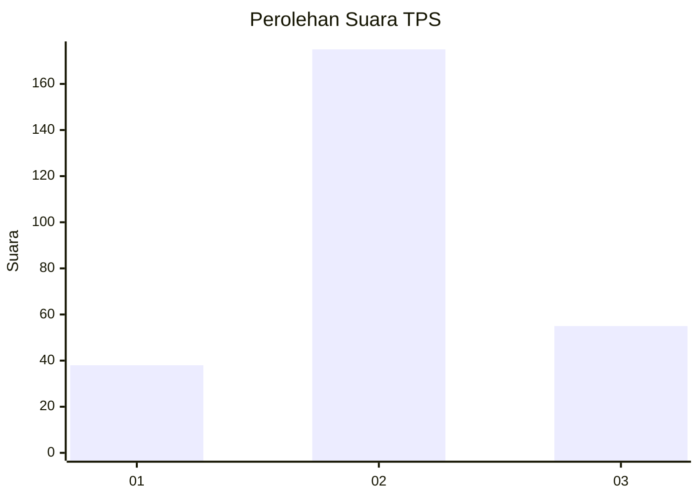
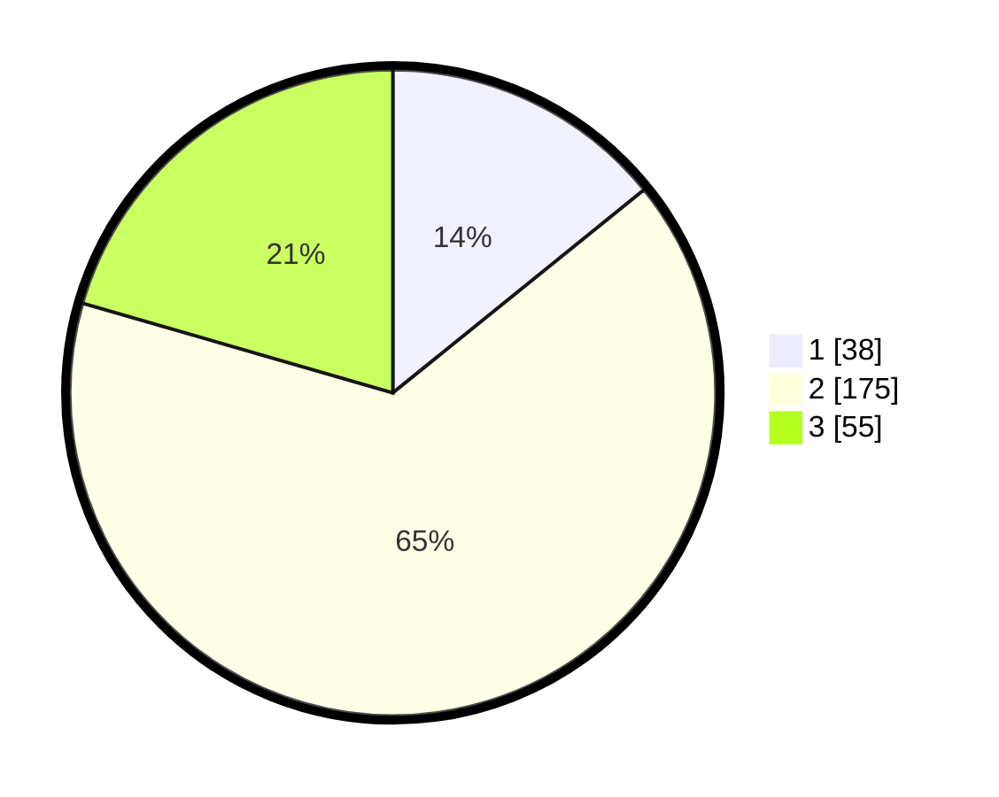

# Hasil

## Grafik

## Tabel

| No. | Nama Paslon    | Suara | Suara (raw) | Persentase |
|:--- |:-------------- | -----:| -----------:| ----------:|
| 1   | ANIES MUHAIMIN | 38    | [38][p-1]   | 14,18      |
| 2   | PRABOWO GIBRAN | 175   | [175][p-2]  | 65,30      |
| 3   | GANJAR MAHFUD  | 55    | [55][p-3]   | 20,52      |

[p-1]: https://github.com/gigit-pemilu/pemilu-2024/blob/main/pilpres/hitung-suara/sub/33-jawa-tengah/sub/76-kota-tegal/sub/03-tegal-selatan/sub/1007-debong-tengah/sub/027-tps/sub/paslon-1.txt
[p-2]: https://github.com/gigit-pemilu/pemilu-2024/blob/main/pilpres/hitung-suara/sub/33-jawa-tengah/sub/76-kota-tegal/sub/03-tegal-selatan/sub/1007-debong-tengah/sub/027-tps/sub/paslon-2.txt
[p-3]: https://github.com/gigit-pemilu/pemilu-2024/blob/main/pilpres/hitung-suara/sub/33-jawa-tengah/sub/76-kota-tegal/sub/03-tegal-selatan/sub/1007-debong-tengah/sub/027-tps/sub/paslon-3.txt

## Foto C Plano

https://sirekap-obj-formc.kpu.go.id/dcb1/pemilu/ppwp/33/76/03/10/07/3376031007027-20240215-022953--f172701f-eaa8-486d-9026-008ed7ee3d7c.jpg

https://sirekap-obj-formc.kpu.go.id/dcb1/pemilu/ppwp/33/76/03/10/07/3376031007027-20240215-060040--27025f71-00cd-4d35-a321-7313ea55af0e.jpg

https://sirekap-obj-formc.kpu.go.id/dcb1/pemilu/ppwp/33/76/03/10/07/3376031007027-20240215-023242--dbec2203-8e54-4254-83ec-b47e15bc18ec.jpg

## Metadata

| Key        | Value               |
| ---------- | ------------------- |
| Time Stamp | 2024-02-15 15:00:29 |

